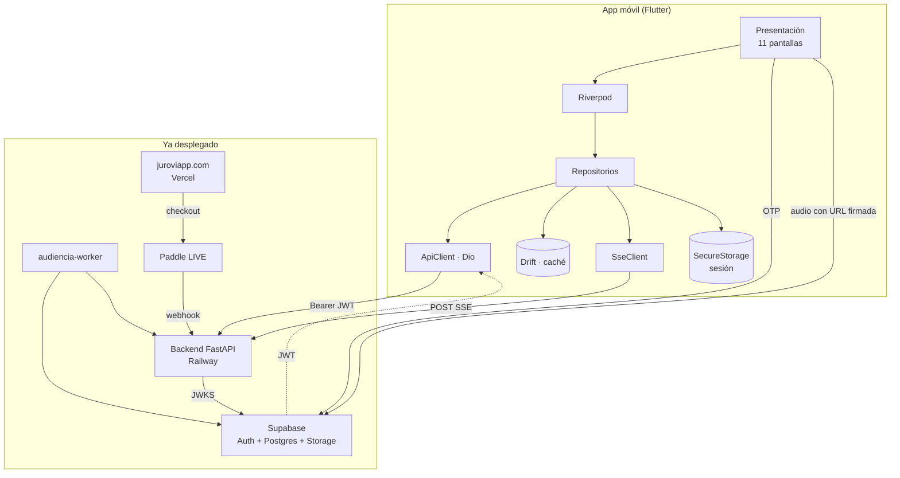

# Arquitectura — App móvil Jurovia

> Documento de arquitectura de software. Define cómo se construye el cliente móvil
> de Jurovia en Flutter, cómo se conecta con lo que ya está desplegado, y qué
> decisiones se toman y por qué.
>
> **Versión** 1.0 · 28 de julio de 2026
> **Autor** Arquitectura · **Estado** propuesto, pendiente de aprobación
> **Basado en** prototipo `ContextDesign/` · backend `Legal_AI_Backend` · frontend `Legal_AI_Frontend`

---

## 1. Contexto

### 1.1 Qué existe hoy

Jurovia es un asistente jurídico con IA para abogados colombianos, **en producción**.
La app móvil no reemplaza nada: es un **cliente nuevo sobre la misma plataforma**.

| Pieza | Dónde | Estado |
| --- | --- | --- |
| Backend FastAPI | Railway · `legal-ai-backend-production-bdd2.up.railway.app` | vivo, 137 rutas |
| Worker de audiencias | Railway · `audiencia-worker` | vivo |
| Autopilot del embudo | Railway · `funnel-autopilot` | vivo |
| Publicador de Instagram | Railway · `ig-worker` | vivo (marketing, ajeno al producto) |
| Frontend Next.js | Vercel · `juroviapp.com` | vivo |
| Datos + Auth | Supabase `Legal_AI` (us-west-2) | vivo |
| Cobro | Paddle **LIVE** | vivo |
| Archivos de la app | Supabase Storage (bucket `audiencia_tmp`) | vivo |
| Vídeo de marketing | Cloudflare R2 (bucket `vsl`) | vivo · **ajeno a la app** |

### 1.2 Alcance de la app

**Dentro:** cliente iOS + Android que consume el backend existente.

**Fuera:** nada de backend nuevo. La app **no despliega servicios**. Si algo falta,
se añade al backend de Railway, no a la app.

### 1.3 Principio rector

> **El backend es la única fuente de verdad.** La app es una vista.
> Nada de lógica de negocio, precios, permisos ni cuotas replicada en el cliente.

Esto no es purismo: `GET /api/me` ya devuelve identidad, plan, *entitlements*, modelo
de acceso y *feature flags* resueltos server-side. Duplicar eso en Dart garantiza
divergencia.

---

## 2. Decisiones de arquitectura

| # | Decisión | Alternativa descartada | Razón |
| --- | --- | --- | --- |
| ADR-01 | **Flutter 3.44.8** | React Native / Expo | Decisión del negocio (28-jul-2026). Ver §11 sobre el costo en iOS. |
| ADR-02 | **Feature-first**, no capas globales | Clean Architecture completa | 11 pantallas no justifican 3 capas por entidad. Se agrupa por función. |
| ADR-03 | **Riverpod** para estado | Bloc / Provider | Seguro en compilación, sin `BuildContext` para leer, se testea sin widgets. El estado del chat en streaming es lo más complejo y Riverpod lo modela con `StreamNotifier` sin ceremonia. |
| ADR-04 | **go_router** | Navigator 1.0 | El deep link `jurovia://` es requisito de auth (OTP) y del embudo Web2App. go_router lo resuelve declarativamente. |
| ADR-05 | **Dio** + SSE manual sobre `ResponseType.stream` | `EventSource` / paquetes SSE | **Crítico:** el backend expone el chat como `POST` con cuerpo JSON y responde `text/event-stream`. `EventSource` **solo hace GET y no envía cuerpo**, así que ningún cliente SSE estándar sirve. Hay que leer el stream a mano. Es la misma razón por la que el frontend web usa `fetch` + `getReader()` en vez de `EventSource`. |
| ADR-06 | **supabase_flutter** para auth | Auth propia contra el backend | Supabase ya emite el JWT que el backend valida por JWKS. Su SDK ya resuelve refresh, persistencia y OTP. |
| ADR-07 | **Drift (SQLite)** para caché local | Hive / Isar / sin caché | Historial de chats y casos deben leerse sin red. Drift da consultas tipadas y migraciones, que es lo que se necesita cuando el esquema cambie. |
| ADR-08 | **freezed + json_serializable** | Modelos a mano | 137 rutas. Los modelos a mano se desincronizan del backend en semanas. |
| ADR-09 | **Sin compra dentro de la app** | IAP nativo | Embudo Web2App. Ver §9. |
| ADR-10 | Config por **`--dart-define`** | archivos `.env` embebidos | Un `.env` dentro del bundle es extraíble igual, y `--dart-define` permite que CI inyecte por entorno sin archivos. |

---

## 3. Vista de sistema



**Lo que la app NO hace:** hablar con Paddle, con R2, con Anthropic ni con ningún
proveedor. Todo pasa por el backend. La app solo conoce **dos hosts**: Supabase
(auth) y el backend (todo lo demás).

---

## 4. Estructura del proyecto

```
lib/
├─ main.dart
├─ app.dart                       # MaterialApp.router + tema
├─ core/
│  ├─ config/app_config.dart      # --dart-define (ya existe)
│  ├─ network/
│  │  ├─ api_client.dart          # Dio + interceptores
│  │  ├─ auth_interceptor.dart    # Bearer + refresh en 401
│  │  ├─ sse_client.dart          # ← pieza crítica, §6
│  │  └─ api_exception.dart
│  ├─ storage/
│  │  ├─ secure_store.dart
│  │  └─ database.dart            # Drift
│  ├─ router/app_router.dart      # go_router + deep links
│  ├─ theme/                      # tokens del prototipo, §8
│  └─ errors/failure.dart
├─ features/
│  ├─ auth/          {data,domain,presentation}
│  ├─ onboarding/
│  ├─ home/
│  ├─ chat/                       # el núcleo
│  ├─ documents/
│  ├─ cases/
│  ├─ hearings/
│  ├─ inbox/
│  └─ profile/
└─ shared/
   ├─ widgets/                    # botón aurora, chip verificado, etc.
   └─ models/                     # Me, Plan, Entitlements
```

Cada *feature* con `data/` (DTOs + repositorio), `domain/` (entidades + casos de
uso solo cuando aportan) y `presentation/` (providers + pantallas + widgets).
**No se crea `domain/` vacío por simetría.**

---

## 5. Autenticación y sesión

### 5.1 Flujo

```
Splash → ¿sesión en SecureStorage?
  sí  → GET /api/me → Home
  no  → Onboarding (3 slides) → Login
         → correo → Supabase signInWithOtp
         → código 6 dígitos → verifyOTP
         → JWT → GET /api/me → Home
```

### 5.2 Cómo funciona contra el backend

El backend (`app/auth.py`) **verifica la firma** del JWT de Supabase por JWKS
(ES256/RS256) y **resuelve `org_id` server-side desde `memberships`**. Nunca confía
en cabeceras del cliente.

**Consecuencia para la app:** basta con mandar `Authorization: Bearer <access_token>`.
No hay que enviar `org_id` ni nada parecido — y si se enviara, se ignora. El
aislamiento entre despachos no depende del cliente.

### 5.3 Deep link — bloqueante

El OTP necesita volver a la app. Requiere:

1. `jurovia://` registrado — **ya hecho** en `Info.plist` y `AndroidManifest.xml`.
2. **`jurovia://**` añadido a Supabase → Auth → URL Configuration.
   **Hoy la `uri_allow_list` solo tiene dominios web.** Sin esto el login no cierra.

### 5.4 Renovación

`jwt_exp` = 3600 s. El SDK de Supabase renueva solo; el `AuthInterceptor` reintenta
**una vez** ante un 401 tras forzar refresh, y si vuelve a fallar cierra sesión.

> **Google/Apple Sign-In:** el prototipo dibuja "Continuar con Google", pero en
> Supabase `external_google_enabled = false`. O se habilita, o se quita del diseño.
> En iOS, si se habilita Google, Apple **exige** también Sign in with Apple.

---

## 6. El contrato SSE — la pieza crítica

Es la parte de mayor riesgo técnico de toda la app.

### 6.1 Por qué no sirve un cliente SSE normal

```
POST /api/chat/{session_id}
Authorization: Bearer <jwt>
Content-Type: application/json
{ "message": "...", "matter_id": "...", "document_ids": [...] }

→ 200 text/event-stream
```

`EventSource` (y casi todo paquete SSE de pub.dev) **solo hace GET y no manda
cabeceras ni cuerpo**. Hay que implementar el cliente a mano sobre
`Dio` con `ResponseType.stream`, acumulando bytes y partiendo por `\n\n`.

### 6.2 Eventos que emite el backend

De `app/bridge.py` y `app/agent/runner.py`:

| Evento | Carga | Qué hace la UI |
| --- | --- | --- |
| `thinking` | `{text, message_id}` | Alimenta "Pensó durante Xs" (colapsado) |
| `text_delta` | `{text, message_id}` | Concatena a la respuesta en streaming |
| `phase` | `{name, status}` | Timeline de actividad |
| `agent_step` | paso del agente | Panel de actividad |
| `tool_call` | `{id, name, input}` | Chip de herramienta en curso |
| `tool_result` | resultado | Cierra el chip |
| `verify_progress` | `{status, ...}` | Progreso de verificación de fuentes |
| `artifact` | documento generado | **Tarjeta de documento** (§7.3) |
| `approval_request` | solicitud | Sheet de aprobación |
| `hooks` | `{hooks:[{label,tipo,prompt}]}` | Chips de próxima acción |
| `credits` | `{balance, cap, low}` | Actualiza saldo en el header |
| `usage` | tokens/costo | Telemetría |
| `blocked` | `{reason, message}` | **Muro de plan** (§9.3) |
| `error` | `{message, subtype}` | Error en la burbuja |
| `done` | `{session_id, result}` | Cierra el turno |
| *heartbeat* | comentario SSE | **Mantener viva la conexión** |

### 6.3 Requisitos de implementación

- **Los heartbeats importan.** El backend los emite justo antes de bloques largos
  sin salida (persistencia, revisión, consolidación). El cliente **no debe** tratar
  el silencio como desconexión antes de ~90 s.
- **Reconexión:** si el stream cae a mitad, la app reintenta con *backoff* y luego
  recarga con `GET /api/sessions/{id}`, porque el backend **ya persistió** el turno.
  No se reenvía el mensaje: se duplicaría y volvería a cobrar créditos.
- **Ciclo de vida:** si la app pasa a segundo plano, el SO puede matar el socket.
  El turno sigue en el servidor; al volver se recarga la sesión. **No se cancela.**
- Un turno de investigación puede tardar minutos → sin timeouts agresivos.

> Esto merece su propio paquete y sus propias pruebas, con un *fake* que reproduzca
> el stream evento por evento. Es lo primero que hay que construir.

---

## 7. Mapa pantalla → API

| Pantalla | Endpoints |
| --- | --- |
| Splash | `GET /api/me` |
| Onboarding | — (local) |
| Login | Supabase `signInWithOtp` / `verifyOTP` |
| **Inicio** | `GET /api/me`, `GET /api/tasks`, `GET /api/deadlines`, `GET /api/sessions`, `GET /api/notifications/unread-count` |
| **Chat** | `POST /api/chat/{id}` (SSE), `GET /api/sessions/{id}`, `GET /api/credits` |
| Documento | `POST /api/documents`, `GET /api/missions/{id}/documents` |
| **Casos** | `GET /api/missions`, `GET /api/missions/attention` |
| Detalle caso | `GET /api/missions/{id}`, `/timeline`, `/documents`, `POST /run-workflow` (SSE) |
| Audiencia | `POST /api/audiencias/upload-url`, `POST /api/audiencias`, `GET /api/audiencias/{job_id}` |
| Bandeja | `GET /api/notifications`, `POST /{id}/read`, `/read-all`, `GET /api/approvals` |
| Perfil | `GET /api/me`, `GET /api/plans`, `GET /api/integrations`, `POST /api/me/delete` |

De las **137 rutas, la app usa ~35**. Las 45 de `admin`, 15 de `jobs` y todo lo de
marketing (`ig_admin`, `campaigns`, `vsl`, `track`, `meta`) **no se exponen**.

### 7.1 Bootstrap

`GET /api/me` devuelve en una sola llamada:

```json
{ "user_id", "email", "org_id", "plan", "trial_ends_at",
  "entitlements", "features", "onboarded", "access" }
```

Es **la** llamada de arranque: decide onboarding, qué módulos se ven (`features`),
qué puede hacer (`entitlements`) y qué muro mostrar (`access`). Se cachea en memoria
y se refresca al volver a primer plano y tras cada `done` del chat.

### 7.2 Audiencias — subida en 3 pasos

1. `POST /api/audiencias/upload-url` → devuelve una URL firmada de **Supabase Storage**,
   bucket temporal `audiencia_tmp`, ruta `{org_id}/{uuid}.bin`.
2. La app sube el archivo **directo a Supabase Storage**, sin pasar por el backend.
3. `POST /api/audiencias` encola el job → *polling* de `GET /api/audiencias/{job_id}`.

El `audiencia-worker` de Railway lo descarga, extrae el audio, transcribe y **borra el
temporal**. Un audio de audiencia puede durar horas: subirlo a través del backend lo
tumbaría. La app necesita subida reanudable y aviso de "solo por Wi-Fi".

> Ojo: esto usa **Supabase Storage**, no Cloudflare R2. R2 (bucket `vsl`) es de
> marketing y la app no lo toca.

### 7.3 Documentos

El evento `artifact` del SSE trae el documento generado. La tarjeta abre un visor.
La **edición** vuelve por el chat (`edit_artifact_id` + `selection` en `ChatRequest`),
igual que en web: no se edita el DOCX en el cliente.

---

## 8. Sistema de diseño

Extraído del prototipo. **Fuente de verdad: `ContextDesign/`.**

### 8.1 Color

```dart
// Gradiente Aurora — identidad de marca
const aurora = LinearGradient(
  begin: Alignment.topLeft, end: Alignment.bottomRight,
  colors: [Color(0xFFFF3D7F), Color(0xFFD23BE0), Color(0xFF7B3DF5), Color(0xFF2F6BFF)],
  stops: [0.0, 0.34, 0.68, 1.0],
);
```

| Rol | Token |
| --- | --- |
| Fondo app | `#F7F8FB` |
| Superficie | `#FFFFFF` |
| Texto primario | `#191427` |
| Texto secundario | `#566076` |
| Texto terciario | `#8A93A6` |
| Borde | `#E7EAF1` · `#D7DCE8` · `#F1F3F8` |
| Primario | `#7B3DF5` (hover `#5C1FD6`) |
| **Verificado (dorado)** | `#C98A14` · texto `#8A5D08` · icono `#F2B338→#E8902A` |
| Vigilancia | `#2563EB` |
| Término | `#D97706` |
| Destructivo | `#DC2626` |

> **Regla inviolable:** el dorado significa **fuente contrastada contra fuente
> oficial**. Ni un elemento decorativo lo usa. Es la promesa del producto.

### 8.2 Tipografía

| Familia | Uso |
| --- | --- |
| **Inter** 400/500/600/700 | interfaz |
| **Space Grotesk** 500/600/700 | títulos, cifras, logotipo |
| **Source Serif 4** 400/600 | cuerpo de documentos jurídicos |
| **JetBrains Mono** 400/500 | radicados |

Se empaquetan **locales** (`google_fonts` con assets, no descarga en runtime): la app
debe abrir sin red y sin FOUT.

### 8.3 Forma y movimiento

Radios: `999px` píldoras · `22px` composer · `18px` tarjetas · `14px` campos · `46px` marco.
Animaciones: `jvFade`, `jvSlide` (drawer .26s), `jvSheet` (.3s), `jvSpin`, `jvPulse`, `jvBar`.
Curva de marca: `cubic-bezier(.34,1.56,.64,1)`.
**Respetar `prefers-reduced-motion`** (el prototipo ya lo hace).

### 8.4 Navegación

- **Bottom nav** con 4 destinos + **FAB central al chat**: Inicio · Casos · **[+]** · Bandeja · Perfil.
- Visible solo en `home`, `cases`, `inbox`, `profile`. Oculta en chat, documento, caso, audiencia.
- **Drawer lateral** con historial de chats (patrón ChatGPT).
- El chat **no es una pestaña**: es el FAB. Decisión explícita del diseño.

### 8.5 Modo oscuro

El prototipo es solo claro y declara el oscuro como pendiente. **Definir los tokens
oscuros antes de construir pantallas**, no después: reajustar 11 pantallas cuesta
mucho más que declarar el `ColorScheme` desde el principio.

---

## 9. Monetización — Web2App

### 9.1 La estrategia

Captación y cobro en **juroviapp.com** con Paddle. La app es para **usar**, no para
comprar. Evita la comisión de tienda (15–30%) y no duplica el sistema de cobro.

### 9.2 Lo que la app puede y no puede hacer

| Puede | No puede |
| --- | --- |
| Registro y prueba gratis | Botón de comprar / suscribirse |
| Mostrar "Tu plan: Pro" | Abrir el checkout de Paddle |
| Mostrar cuota restante | Enlazar a juroviapp.com para pagar |
| Decir "alcanzaste el límite" | Decir "suscríbete en nuestra web" |

Apple **3.1.1** obliga a IAP para desbloquear funciones digitales; el enlace externo
solo está permitido en la tienda de **EE. UU.**, y el mercado es Colombia.
La cobertura es la regla **3.1.3(b)**, la misma que usan Notion, Slack y Figma.

`AppConfig.showPaddleCheckout = false` fija esto, con una prueba que falla si se
enciende.

### 9.3 Qué hacer al agotar la cuota

Al recibir `blocked` en el SSE, o `access` sin turnos: pantalla que informa el estado
y **no vende**. Sin botón, sin enlace, sin mención de la web. El usuario que quiera
mejorar su plan lo hará donde ya lo hace hoy.

### 9.4 El traspaso web → app

**Fase 1 (v1):** el usuario paga en la web e inicia sesión en la app con el mismo
correo. `GET /api/me` ya devuelve el plan correcto. **Funciona sin construir nada**,
porque el backend ya es la fuente de verdad. Su costo es escribir el correo una vez.

**Fase 2 (opcional):** *deferred deep link* con token de un solo uso para auto-login
tras instalar. Mejora la conversión pero **no es fiable en iOS**, y el 71% del tráfico
entra por el navegador embebido de Facebook, que es justo donde peor funciona.
Debe degradar al login normal siempre.

---

## 10. Contradicciones detectadas entre el prototipo y producción

Hay que resolverlas **antes** de construir. No son detalles.

| # | Prototipo | Producción | Impacto |
| --- | --- | --- | --- |
| 1 | **"Continuar con Pro"** en el sheet de planes | Apple lo rechaza | **Bloqueante.** Es un CTA de compra. Quitar del build de tienda. |
| 2 | **"Facturación en la web de Jurovia"** | Apple lo considera *steering* | **Bloqueante.** Quitar ese texto. |
| 3 | "Continuar con Google" | `external_google_enabled = false` | Habilitar en Supabase (+ Apple Sign-In en iOS) o quitar del diseño. |
| 4 | Planes **Pro $149.000** / **Estudio $489.000** COP | `/api/plans`: `estandar` $9 · `pro` $18 · `firma` $45 USD, `cop_rate` 4000 → **$36.000 / $72.000 / $180.000** | Nombres y precios no coinciden. **La app debe pintar `/api/plans`, nunca precios en duro.** |
| 5 | "180 créditos" con barra de progreso | El modelo vigente puede ser `trial_daily` (turnos/día) según `access` en `/api/me` | La UI debe **ramificar según `access.model`**, no asumir créditos. |
| 6 | Modo oscuro ausente | — | Definir tokens antes de construir. |

> Además, `/api/plans` reporta hoy `active: false` en `estandar`, `pro` y `firma`.
> Hay que confirmar qué significa antes de construir la pantalla de planes.

---

## 11. Restricciones de plataforma

### 11.1 iOS exige macOS

Xcode no existe para Windows. Consecuencias reales:

- El workflow de release corre en `macos-latest` (~10× el costo de minutos Linux).
- Para desarrollo diario de iOS **hace falta un Mac**. Hoy no hay ninguno.
- **Nada de iOS puede verificarse desde el entorno actual.**

Es el costo de Flutter frente a EAS, que compilaba iOS en la nube.

### 11.2 Firma

Android: keystore propio. **Con Play App Signing activo**, perderlo es recuperable;
sin él, significa no poder volver a actualizar la app jamás.
iOS: certificado de distribución + perfil + llave `.p8` (descargable una sola vez).

### 11.3 Permiso `INTERNET` — corregido

La plantilla de Flutter declara `INTERNET` **solo** en los manifiestos de debug y
profile. El build de release habría salido sin red: perfecto en desarrollo, muerto
en la tienda. **Ya está añadido al manifiesto principal.** No quitarlo.

---

## 12. Seguridad

| Aspecto | Decisión |
| --- | --- |
| Tokens | `flutter_secure_storage` (Keychain / Keystore). **Nunca** en `SharedPreferences`. |
| Secretos | Solo la **anon key** de Supabase, pública por diseño y protegida por RLS. `service_role` y llaves de proveedores **jamás** en el binario. |
| Aislamiento | El backend resuelve `org_id` server-side. La app no lo envía ni puede falsearlo. |
| Transporte | TLS. `usesCleartextTraffic` desactivado. |
| Datos en reposo | La caché de Drift contiene información de clientes de abogados. Cifrar la base (SQLCipher) y purgarla al cerrar sesión. |
| Logs | Nunca registrar JWT, contenido de casos ni respuestas del agente en producción. |
| Ofuscación | `--obfuscate --split-debug-info` en release. |
| Borrado de cuenta | `POST /api/me/delete` **ya existe**: cancela Paddle, borra en cascada y limpia por correo. La app solo lo invoca. |

---

## 13. Observabilidad

- **Crashes:** Sentry o Crashlytics — decisión pendiente.
- **Producto:** el backend ya tiene analítica propia (`/api/track`, `analytics_events`).
  **Reusarla**, no meter un proveedor nuevo.
- **Costos:** `usage` del SSE ya alimenta el FinOps existente. La app no calcula nada.
- **Salud del SSE:** métrica propia de reconexiones y streams caídos. Es donde más
  va a doler en redes móviles colombianas.

---

## 14. Pruebas

| Nivel | Alcance |
| --- | --- |
| Unitarias | Parser SSE (**prioridad máxima**), mapeo de modelos, lógica de *entitlements* |
| Widget | Las 11 pantallas con datos falsos; estados vacío / cargando / error |
| Integración | Login → chat → documento, contra un backend simulado |
| Golden | Componentes de marca: gradiente aurora, chip verificado |
| Reglas de tienda | La prueba que fija `showPaddleCheckout == false` **no se borra** |

El parser SSE necesita un *fake* que reproduzca streams reales grabados, incluidos
los casos feos: heartbeat largo, corte a mitad de evento, `error` tras `text_delta`.

---

## 15. Plan por fases

### Fase 0 — Cimientos (hecho)
Proyecto, identificadores, firma, CI, permisos, deep link.

### Fase 1 — Esqueleto vivo
Tema y tokens · `ApiClient` + interceptores · **`SseClient` + pruebas** · login OTP ·
`GET /api/me` · Home básico. **Objetivo: un turno de chat real de punta a punta.**

### Fase 2 — El núcleo
Chat completo (thinking, fuentes, artefactos, hooks, créditos) · historial · drawer ·
tarjeta de documento y visor.

### Fase 3 — El producto
Casos + detalle + timeline · Bandeja · Perfil · adjuntos y cámara.

### Fase 4 — Diferenciadores
Audiencias (subida a R2 + polling) · notificaciones push de términos · offline.

### Fase 5 — Tienda
Icono y capturas · borrado de cuenta en la app · modo oscuro · TestFlight / prueba
cerrada · envío.

> **Fase 1 antes que nada.** Si el `SseClient` no queda sólido, todo lo demás se
> construye sobre arena.

---

## 16. Riesgos

| Riesgo | Impacto | Mitigación |
| --- | --- | --- |
| **Rechazo de Apple por 3.1.1** | Alto | Capa gratuita real, cero comercio en la app, argumento 3.1.3(b) preparado para el Resolution Center |
| **SSE sobre redes móviles** | Alto | Heartbeats, reconexión con recarga de sesión, nunca reenviar el turno |
| **Sin Mac para iOS** | Alto | Conseguir uno, o CI-only con ciclos muy lentos |
| Turnos largos en segundo plano | Medio | El servidor persiste; al volver se recarga |
| Prototipo ≠ producción (§10) | Medio | Resolver las 6 contradicciones antes de construir |
| D-U-N-S si Apple es empresa | Medio | Solicitarlo ya; tarda semanas |
| Deep link diferido poco fiable | Bajo | Fase 2, siempre con caída al login normal |

---

## 17. Decisiones abiertas

1. **¿Apple como empresa o individuo?** Define si hay que pedir D-U-N-S hoy.
2. **¿Bundle ID definitivo?** `com.jurovia.app` está configurado; no se puede cambiar tras publicar.
3. **Los 6 puntos del §10**, sobre todo precios y nombres de planes.
4. **¿`active: false` en los planes de pago** qué significa?
5. **Crashes:** Sentry o Crashlytics.
6. **¿Qué hace la app sin conexión?** Solo lectura de caché, o cola de envíos.
7. **¿Modo oscuro en v1** o después?

---

## 18. Referencias

- Prototipo: [`ContextDesign/jurovia-app-prototype-con-ui-de-chatgpt/`](ContextDesign/)
- Contrato SSE: `Legal_AI_Backend/app/bridge.py` · `app/agent/runner.py`
- Auth: `Legal_AI_Backend/app/auth.py`
- Referencia de UI web: `Legal_AI_Frontend/components/juridica/ChatView.tsx`
- Despliegue a tiendas: [`docs/DESPLIEGUE_TIENDAS.md`](docs/DESPLIEGUE_TIENDAS.md)
