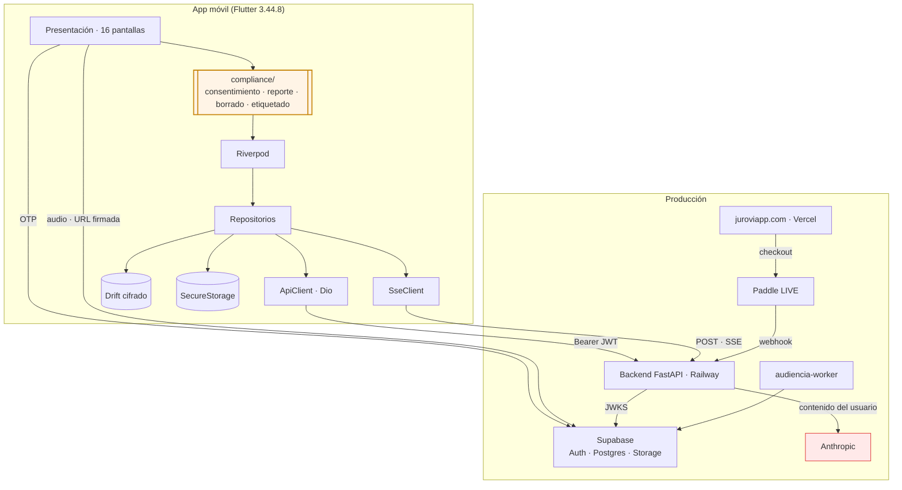

# Arquitectura — App móvil Jurovia · V2

> Segunda versión de la arquitectura. Reescrita para que **el cumplimiento de las
> tiendas sea una propiedad estructural del código**, no una lista de tareas al final.
>
> **Versión** 2.0 · 28 de julio de 2026 · sustituye a `ARQUITECTURA_APP_MOVIL.md`
> **Entradas** `AuditCheck.md` (162 requisitos) · `ContextDesign/` (prototipo) ·
> `Legal_AI_Backend` · `Legal_AI_Frontend` · producción en Railway, Vercel y Supabase
> **Estado** propuesto · pendiente de aprobación

---

## Índice

| | |
| --- | --- |
| [§1 Qué cambia respecto a V1](#s1) | [§11 Datos, persistencia y **sincronización**](#s11) |
| [§2 Principios](#s2) | [§12 Permisos y privacidad](#s12) |
| [§3 Vista de sistema](#s3) | [§13 Monetización Web2App](#s13) |
| [§4 Capa de cumplimiento](#s4) | [§14 Decisiones cerradas](#s14) |
| [§5 Estructura del proyecto](#s5) | [§15 CI/CD y despliegue](#s15) |
| [§6 Sistema de diseño](#s6) | [§16 Pruebas](#s16) |
| [§7 Inventario de pantallas](#s7) | [§17 Plan de implementación](#s17) |
| [§8 Navegación y rutas](#s8) | [§18 Trazabilidad AuditCheck](#s18) |
| [§9 Autenticación](#s9) | [§19 Riesgos](#s19) |
| [§10 Contrato SSE](#s10) | |

---

<a id="s1"></a>
## §1 · Qué cambia respecto a V1

V1 describía una app correcta que **habría sido rechazada**. V2 corrige eso.

| Cambio | Motivo |
| --- | --- |
| **Nueva capa `compliance/`** de primer nivel | 4 requisitos bloqueantes (consentimiento IA, reporte, borrado de cuenta, etiquetado) no son *features*: son puertas que atraviesan toda la app |
| **`AiConsentGate` bloquea el agente** | Apple 5.1.2(i) exige permiso explícito **antes** de enviar datos a IA de terceros. Se implementa como puerta, no como aviso |
| **De 11 a 16 pantallas** | 5 nuevas nacen del AuditCheck, no del prototipo |
| **Las 6 contradicciones de V1 §10 quedan cerradas** (§14) | Eran decisiones abiertas; ahora son decisiones tomadas |
| **Sheet de planes → "Tu plan" de solo lectura** | El prototipo tenía CTA de compra y texto de *steering*: rechazo seguro |
| **Login solo OTP**, sin Google | Elimina por completo la regla 4.8 (Sign in with Apple) |
| **Sin SDK publicitarios** como regla arquitectónica | Elimina ATT, dominios de rastreo y una categoría de rechazos |
| **Tokens de diseño en Dart real** (§6) | V1 los listaba; V2 los deja listos para pegar |
| **Matriz de trazabilidad** (§18) | Cada requisito del AuditCheck apunta a un archivo concreto |
| **Sincronización multi-dispositivo** (§11.2–11.6) | Web y móvil comparten base; había que definir el modelo de consistencia, el refresco y —sobre todo— el manejo de mensajes en estado `streaming`, que sin tratar produce burbujas vacías |

---

<a id="s2"></a>
## §2 · Principios

**P1 · El backend es la única fuente de verdad.**
`GET /api/me` ya resuelve identidad, plan, *entitlements*, *features* y modelo de
acceso. Nada de eso se recalcula en Dart.

**P2 · Cumplimiento por construcción.**
Si un requisito de tienda se puede violar accidentalmente, está mal diseñado. El
consentimiento es una puerta; la ausencia de comercio es una constante compilada con
prueba que falla si cambia.

**P3 · Superficie mínima.**
Cada permiso, SDK y dominio añadido es una casilla más del AuditCheck. Se añade solo
lo que la función exige, cuando la exige.

**P4 · La marca es funcional, no decorativa.**
El dorado significa *fuente verificada*. Usarlo de adorno rompe la promesa del
producto y la regla 2.3 de metadata veraz.

**P5 · Degradar, nunca romper.**
Sin red, sin créditos, sin consentimiento: la app dice qué pasa y qué puede hacer el
usuario. Nunca pantalla en blanco ni error críptico.

---

<a id="s3"></a>
## §3 · Vista de sistema



La arista **`BE → ANT`** es la que obliga a la capa de cumplimiento: el contenido de
los casos sale hacia un tercero. La app no la ejecuta, pero **es responsable de
haberla consentido**.

**Dominios que la app conoce:** Supabase y el backend. Nada más.

---

<a id="s4"></a>
## §4 · Capa de cumplimiento

El aporte central de V2. Vive en `lib/compliance/` y **envuelve** al resto.

### 4.1 · Puerta de consentimiento de IA

> **AuditCheck C8.1–C8.7 · Apple 5.1.2(i)** — el único bloqueante que puede costar el
> lanzamiento entero.

```
Login OK
  └─> GET /api/me
       └─> ¿consents.ai_processing == true?
            ├─ sí  → Home
            └─ no  → AiConsentScreen  ← el agente NO es alcanzable
                      ├─ Aceptar  → POST /api/consents {ai_processing:true} → Home
                      └─ Rechazar → Home en modo limitado (sin chat)
```

**Contrato obligatorio de la pantalla**

| Requisito | Implementación |
| --- | --- |
| Antes del primer uso | `redirect` de go_router; el agente es inalcanzable sin ello |
| Proveedor por nombre | Texto fijo: **"Anthropic (Claude)"** |
| Qué datos se envían | Mensajes, documentos adjuntos, contexto del caso |
| Acción afirmativa | Botón explícito. **No** "al continuar aceptas" |
| No enterrado | Pantalla propia, no un enlace a los términos |
| Revocable | Perfil → Privacidad y datos → revocar |
| Registro server-side | Tabla `consents` (ya existe) |

```dart
// lib/compliance/ai_consent/ai_consent_gate.dart
class AiConsentGate {
  static const provider = 'Anthropic (Claude)';
  static const version  = 1;   // subir obliga a re-consentir

  /// Única puerta hacia el agente. Ningún repositorio de chat
  /// debe poder invocarse sin pasar por aquí.
  static bool canUseAgent(Me me) =>
      me.consents.aiProcessing && me.consents.aiVersion >= version;
}
```

> **Regla de diseño:** `ChatRepository` recibe un `AiConsentToken` en su constructor,
> y ese token **solo** lo emite el gate. Así el compilador impide invocar al agente
> sin consentimiento. No depende de que nadie recuerde comprobarlo.

### 4.2 · Etiquetado y reporte de contenido de IA

> **AuditCheck C8.8–C8.15 · Google AI-Generated Content · Apple 1.2**

Cada respuesta del agente lleva:

1. **Etiqueta visible** — el prototipo ya la tiene: el avatar aurora + *"Pensó durante X s"*. Se añade **"Generado por IA"** en la fila de metadatos.
2. **Botón Reportar** — junto a copiar / pulgar / reintentar, que el prototipo ya dibuja.
3. **Hoja de reporte** — motivo + comentario → `POST /api/feedback` (router ya existente).

```
Fila de acciones (prototipo, líneas 325-330):
  [copiar] [pulgar] [reintentar]  →  [copiar] [pulgar] [reintentar] [reportar]
```

> Con un solo botón se cubren **C8.11** (Google) y **A3.1** (Apple 1.2) a la vez.

### 4.3 · Eliminación de cuenta

> **AuditCheck A3.29 · G7.27–G7.31**

| Vía | Dónde | Estado |
| --- | --- | --- |
| Dentro de la app | Perfil → Privacidad y datos → Eliminar cuenta | por construir |
| Web pública | `juroviapp.com/eliminar-cuenta` | **404 hoy — bloqueante de Google** |
| Backend | `POST /api/me/delete` | ✅ existe y borra de verdad |

Flujo en la app: advertencia de irreversibilidad → qué se borra y qué se retiene por
ley → escribir **`ELIMINAR`** (el backend ya lo exige) → confirmación → cierre de
sesión y purga de la caché local.

### 4.4 · Aviso legal

> **AuditCheck A3.3 (1.4.1) · C8.16–C8.19**

| Ubicación | Contenido |
| --- | --- |
| Onboarding, 3.ª diapositiva | "Jurovia no sustituye asesoría legal profesional." |
| Pie de cada respuesta del agente | "Verifica antes de firmar. **Tú revisas y decides.**" |
| Perfil → Legal | Términos, privacidad, cancelación — **dentro de la app** (A3.27) |

La marca ya dice lo correcto: **"Tú revisas y decides."** Solo hay que llevarlo del
material de marketing a la app.

### 4.5 · Constantes de tienda compiladas

```dart
// lib/compliance/store_policy.dart
abstract final class StorePolicy {
  /// Apple 3.1.1 / Google Play Billing. Encenderlo = rechazo.
  static const bool allowsInAppPurchase = false;

  /// Apple 3.1.3: prohibido dirigir a pagar fuera.
  static const bool allowsExternalPurchaseLink = false;

  /// ATT y NSPrivacyTracking dependen de esto. Mantener en false.
  static const bool hasAdvertisingSdk = false;

  /// Apple 4.8: sin login social, no hace falta Sign in with Apple.
  static const bool hasThirdPartyLogin = false;
}
```

Cada constante tiene una prueba que falla si cambia (§16.3). No es ceremonia: es la
diferencia entre enterarse en el *pull request* o en la revisión de Apple tres
semanas después.

---

<a id="s5"></a>
## §5 · Estructura del proyecto

```
lib/
├─ main.dart
├─ app.dart
├─ compliance/                    ← NUEVO en V2
│  ├─ store_policy.dart           # constantes + pruebas de tienda
│  ├─ ai_consent/
│  │  ├─ ai_consent_gate.dart
│  │  ├─ ai_consent_screen.dart
│  │  └─ consent_repository.dart
│  ├─ reporting/
│  │  ├─ report_sheet.dart
│  │  └─ report_repository.dart
│  ├─ account_deletion/
│  │  ├─ delete_account_screen.dart
│  │  └─ deletion_repository.dart
│  └─ legal/
│     ├─ disclaimer_banner.dart
│     └─ legal_links_screen.dart
├─ core/
│  ├─ config/app_config.dart
│  ├─ network/{api_client,auth_interceptor,sse_client,api_exception}.dart
│  ├─ sync/                        ← NUEVO en V2
│  │  ├─ refresh_policy.dart       # cuándo recargar (§11.3)
│  │  ├─ lifecycle_observer.dart   # primer plano → invalidar y recargar
│  │  └─ freshness_indicator.dart  # "actualizado hace X"
│  ├─ storage/{secure_store,database}.dart
│  ├─ router/app_router.dart
│  ├─ theme/{colors,typography,spacing,shapes,theme}.dart
│  └─ errors/failure.dart
├─ features/
│  ├─ auth/  onboarding/  home/  chat/  documents/
│  ├─ cases/  hearings/  inbox/  profile/
└─ shared/
   ├─ widgets/{aurora_button,verified_chip,jurovia_logo,empty_state}.dart
   └─ models/{me,plan,entitlements,consents}.dart
```

`compliance/` está **al nivel de `features/`**, no dentro de una. Es deliberado: no
pertenece a ninguna pantalla, las condiciona a todas.

---

<a id="s6"></a>
## §6 · Sistema de diseño

Extraído del prototipo. **Fuente de verdad: `ContextDesign/`.**

### 6.1 · Color — `core/theme/colors.dart`

```dart
import 'package:flutter/material.dart';

abstract final class JvColors {
  // ── Marca ──────────────────────────────────────────────
  static const rosa    = Color(0xFFFF3D7F);
  static const magenta = Color(0xFFD23BE0);
  static const purpura = Color(0xFF7B3DF5);
  static const azul    = Color(0xFF2F6BFF);
  static const purpuraHover = Color(0xFF5C1FD6);

  /// Gradiente Aurora. Identidad de Jurovia: logo, CTA principal,
  /// FAB del chat, avatar del agente. Nunca en superficies grandes.
  static const aurora = LinearGradient(
    begin: Alignment.topLeft, end: Alignment.bottomRight,
    colors: [rosa, magenta, purpura, azul],
    stops:  [0.0, 0.34, 0.68, 1.0],
  );

  /// Variante corta para elementos pequeños (chips, iconos).
  static const auroraCorta = LinearGradient(
    begin: Alignment.topLeft, end: Alignment.bottomRight,
    colors: [rosa, purpura, azul], stops: [0.0, 0.6, 1.0],
  );

  // ── Superficies (claro) ────────────────────────────────
  static const fondo      = Color(0xFFF7F8FB);
  static const superficie = Color(0xFFFFFFFF);
  static const sutil      = Color(0xFFF1F3F8);

  // ── Texto ──────────────────────────────────────────────
  static const txtPrimario   = Color(0xFF191427);
  static const txtSecundario = Color(0xFF566076);
  static const txtTerciario  = Color(0xFF8A93A6);

  // ── Bordes ─────────────────────────────────────────────
  static const borde       = Color(0xFFE7EAF1);
  static const bordeFuerte = Color(0xFFD7DCE8);

  // ── Semánticos ─────────────────────────────────────────
  /// DORADO = FUENTE VERIFICADA. Uso exclusivo. Ver P4.
  static const verificado      = Color(0xFFC98A14);
  static const verificadoTxt   = Color(0xFF8A5D08);
  static const verificadoFondo = Color(0x12C98A14);
  static const verificadoIcono = LinearGradient(
    begin: Alignment.topLeft, end: Alignment.bottomRight,
    colors: [Color(0xFFF2B338), Color(0xFFE8902A)],
  );

  static const vigilancia = Color(0xFF2563EB);  // vigilancia judicial activa
  static const termino    = Color(0xFFD97706);  // término procesal corriendo
  static const exito      = Color(0xFF16A34A);  // proceso activo, integración OK
  static const peligro    = Color(0xFFDC2626);  // destructivo, no leído
}
```

> **Regla del dorado, verificable en revisión de código:** `verificado*` solo puede
> aparecer en `VerifiedChip`, `SourceCard` y el icono de acta contrastada. Cualquier
> otro uso es un error de producto, no de estilo.

### 6.2 · Tipografía — `core/theme/typography.dart`

| Familia | Pesos | Uso | Empaquetado |
| --- | --- | --- | --- |
| **Inter** | 400·500·600·700 | Interfaz | local en `assets/fonts/` |
| **Space Grotesk** | 500·600·700 | Títulos, cifras, logotipo | local |
| **Source Serif 4** | 400·600 | Cuerpo de documentos jurídicos | local |
| **JetBrains Mono** | 400·500 | Radicados | local |

**Locales, no descargadas.** La app debe abrir sin red y sin parpadeo de fuentes.

Escala tomada del prototipo:

| Rol | Familia | Tamaño / peso | Ejemplo |
| --- | --- | --- | --- |
| Display | Space Grotesk | 36 / 600 · `-0.04em` | Splash |
| Título pantalla | Space Grotesk | 29 / 600 · `-0.02em` | "¿Qué trabajamos hoy?" |
| Título sección | Space Grotesk | 26 / 600 | "Casos", "Bandeja" |
| Título hoja | Space Grotesk | 23 / 600 | "Trabaja sin límites" |
| Cifra destacada | Space Grotesk | 22 / 600 | "T−2", "Traslado" |
| Cuerpo | Inter | 15 / 400 · alto 1.65 | Respuesta del agente |
| Cuerpo fuerte | Inter | 15 / 600 | Títulos de tarjeta |
| Secundario | Inter | 13.5 / 400 | Metadatos |
| Etiqueta | Inter | 11 / 600 · `0.09em` · MAYÚS | "PENDIENTES" |
| Documento | Source Serif 4 | 15.5 / 400 · alto 1.75 | Cuerpo del escrito |
| Radicado | JetBrains Mono | 11 / 400 | `05001310301220230045600` |

### 6.3 · Forma, espacio y movimiento

```dart
abstract final class JvShapes {
  static const pill     = 999.0;  // botones, chips, píldoras
  static const composer = 22.0;
  static const tarjeta  = 18.0;   // 17 en listas, 18 en tarjetas
  static const campo    = 14.0;
  static const hoja     = 26.0;   // esquinas superiores del bottom sheet
  static const avatar   = 11.4;   // logo pequeño (radio proporcional)
}

abstract final class JvMotion {
  /// Curva de marca. Rebote suave, presente en todo el prototipo.
  static const marca = Cubic(0.34, 1.56, 0.64, 1.0);
  static const suave = Cubic(0.34, 1.10, 0.64, 1.0);

  static const fade   = Duration(milliseconds: 300);  // entrada de mensajes
  static const drawer = Duration(milliseconds: 260);
  static const hoja   = Duration(milliseconds: 300);
  static const toggle = Duration(milliseconds: 320);
}
```

Animaciones del prototipo a reproducir: `jvFade` (mensajes), `jvSlide` (drawer),
`jvSheet` (bottom sheet), `jvSpin` (carga), `jvPulse` (los 3 puntos del agente
pensando, con desfase 0 / .15s / .3s en rosa / magenta / azul), `jvBar` (barras del
ecualizador de audiencias, desfase .12s).

**Accesibilidad:** el prototipo ya respeta `prefers-reduced-motion`. En Flutter →
`MediaQuery.disableAnimationsOf(context)`.

### 6.4 · Componentes de marca

| Componente | Regla |
| --- | --- |
| `AuroraButton` | CTA principal. Gradiente aurora + sombra `0 12px 26px -10px rgba(123,61,245,.7)` |
| `VerifiedChip` | Escudo dorado + "Fuente verificada". **Solo con verificación real** |
| `SourceCard` | Tarjeta dorada de fuente. Fondo `verificadoFondo`, borde al 28% |
| `JuroviaLogo` | "Jurov" en `txtPrimario` + "·ia" con `ShaderMask` aurora |
| `AgentAvatar` | Cuadrado 24 px, radio 7.2, gradiente aurora, glifo J |
| `TerminoBadge` | "T−2" sobre `termino`. Solo con término procesal real |
| `RadicadoText` | JetBrains Mono, `txtTerciario`, con `SelectableText` |
| `AiLabel` | **NUEVO V2.** "Generado por IA" junto a "Pensó durante X s" |
| `DisclaimerFooter` | **NUEVO V2.** "Tú revisas y decides." al pie de cada respuesta |

### 6.5 · Modo oscuro

**Decisión: se define ahora, se implementa en Fase 4.** Los `ColorScheme` claro y
oscuro se declaran desde el inicio; ninguna pantalla usa colores literales. Reajustar
16 pantallas después cuesta mucho más que declararlo hoy.

| Token | Claro | Oscuro |
| --- | --- | --- |
| fondo | `#F7F8FB` | `#0F0D18` |
| superficie | `#FFFFFF` | `#1A1626` |
| sutil | `#F1F3F8` | `#241F33` |
| txtPrimario | `#191427` | `#F2F1F7` |
| txtSecundario | `#566076` | `#A9B0C0` |
| borde | `#E7EAF1` | `#2E2840` |
| verificado | `#C98A14` | `#E8A72E` (contraste sobre oscuro) |

El gradiente aurora **no cambia**: es la constante de marca entre modos.

---

<a id="s7"></a>
## §7 · Inventario de pantallas

**16 pantallas.** Las 11 del prototipo + 5 que nacen del AuditCheck.

| # | Pantalla | Origen | Nav inferior | Requisito |
| --- | --- | --- | --- | --- |
| S01 | Splash | prototipo | no | — |
| S02 | Onboarding (3 diapositivas) | prototipo | no | **+ aviso legal en la 3.ª** (C8.16) |
| S03 | Login OTP | prototipo | no | **sin Google** (A3.26) |
| S04 | **Consentimiento de IA** | **AuditCheck** | no | **C8.1–C8.7** 🔴 |
| S05 | Inicio | prototipo | sí | — |
| S06 | Chat | prototipo | no (FAB) | + etiqueta IA + reporte + descargo |
| S07 | Documento | prototipo | no | — |
| S08 | Casos | prototipo | sí | — |
| S09 | Detalle de caso | prototipo | no | — |
| S10 | Audiencia | prototipo | no | — |
| S11 | Bandeja | prototipo | sí | — |
| S12 | Perfil | prototipo | sí | **plan de solo lectura** (A3.15) |
| S13 | **Privacidad y datos** | **AuditCheck** | no | A3.27, C8.6 |
| S14 | **Eliminar cuenta** | **AuditCheck** | no | **A3.29 · G7.27** 🔴 |
| S15 | **Legal** (términos, privacidad, cancelación) | **AuditCheck** | no | A3.27 |
| S16 | **Reportar contenido** (hoja modal) | **AuditCheck** | no | **C8.11** 🔴 |

**Elementos transversales:** drawer lateral con historial · bottom nav de 4 destinos
con FAB central al chat · hoja de "Tu plan".

### 7.1 · Cambios obligados sobre el prototipo

| Pantalla | Cambio | Motivo |
| --- | --- | --- |
| S03 Login | **Quitar "Continuar con Google"** | Google está deshabilitado en Supabase; además evita Sign in with Apple (A3.26) |
| S12 Perfil → hoja de planes | **Quitar "Continuar con Pro"** | Es un CTA de compra → Apple 3.1.1 |
| S12 Perfil → hoja de planes | **Quitar "Facturación en la web de Jurovia"** | Es *steering* → Apple 3.1.3 |
| S12 Perfil → tarjeta de plan | **"Ver planes" → "Tu plan"**, informativa | Íd. |
| S12 Perfil | Precios **desde `/api/plans`**, nunca en duro | El prototipo trae $149.000/$489.000; producción es $9/$18/$45 USD |
| S12 Perfil | Cuota según `access.model` (créditos **o** turnos diarios) | El prototipo asume créditos |
| S06 Chat | Añadir etiqueta IA, botón reportar y descargo | C8.8, C8.11, C8.17 |
| S02 Onboarding | Aviso legal en la 3.ª diapositiva | C8.16 |

> Todo lo demás del prototipo se respeta **tal cual**: composer persistente,
> razonamiento colapsado, dorado de verificado, drawer, FAB central, tarjetas de
> término y vigilancia.

---

<a id="s8"></a>
## §8 · Navegación y rutas

```dart
// core/router/app_router.dart
final router = GoRouter(
  initialLocation: '/splash',
  redirect: (context, state) {
    final sesion = ref.read(sessionProvider);
    final me     = ref.read(meProvider).valueOrNull;

    if (!sesion.autenticado) return '/login';
    if (me == null)          return '/splash';
    if (!me.onboarded)       return '/onboarding';

    // ── Puerta de consentimiento de IA (C8.1) ──
    // Ninguna ruta bajo /chat es alcanzable sin consentir.
    if (!AiConsentGate.canUseAgent(me) && state.uri.path.startsWith('/chat')) {
      return '/consentimiento-ia';
    }
    return null;
  },
  routes: [ /* … */ ],
);
```

| Ruta | Pantalla | Deep link |
| --- | --- | --- |
| `/splash` | S01 | — |
| `/onboarding` | S02 | — |
| `/login` | S03 | — |
| `/auth-callback` | — | **`jurovia://auth-callback`** (OTP) |
| `/consentimiento-ia` | S04 | — |
| `/` | S05 Inicio | `jurovia://` |
| `/chat/:sessionId` | S06 | `jurovia://chat/{id}` |
| `/documento/:id` | S07 | — |
| `/casos` | S08 | `jurovia://casos` |
| `/casos/:matterId` | S09 | `jurovia://casos/{id}` |
| `/audiencia` | S10 | — |
| `/bandeja` | S11 | `jurovia://bandeja` |
| `/perfil` | S12 | — |
| `/perfil/privacidad` | S13 | — |
| `/perfil/eliminar-cuenta` | S14 | — |
| `/perfil/legal` | S15 | — |

**Requisito externo pendiente:** añadir `jurovia://**` a la `uri_allow_list` de
Supabase (Auth → URL Configuration). Hoy solo tiene dominios web. **Sin esto el
login no cierra.**

---

<a id="s9"></a>
## §9 · Autenticación

```
Splash
 └─ ¿sesión en SecureStorage?
     ├─ no → Onboarding → Login (correo) → OTP 6 dígitos → verifyOTP
     └─ sí → GET /api/me
              ├─ !onboarded          → Onboarding
              ├─ !consentimiento IA  → S04 Consentimiento
              └─ ok                  → Inicio
```

- **Solo OTP por correo.** Sin login social → la regla 4.8 no aplica (A3.26).
- El backend verifica la **firma** del JWT por JWKS y resuelve `org_id` desde
  `memberships`. La app solo manda `Authorization: Bearer`.
- `jwt_exp` = 3600 s. El SDK de Supabase renueva; el interceptor reintenta **una vez**
  ante 401 y si falla cierra sesión y **purga la caché local**.
- Tokens en `flutter_secure_storage` (Keychain / Keystore). Nunca en `SharedPreferences`.

---

<a id="s10"></a>
## §10 · Contrato SSE

Sin cambios respecto a V1 salvo la puerta de consentimiento. Es la pieza de mayor
riesgo técnico.

### 10.1 · Por qué no sirve un cliente SSE estándar

```
POST /api/chat/{session_id}
Authorization: Bearer <jwt>
{ "message": "...", "matter_id": "...", "document_ids": [...] }
→ 200 text/event-stream
```

`EventSource` **solo hace GET y no envía cuerpo ni cabeceras**. Hay que leer el stream
a mano con `Dio` + `ResponseType.stream`, acumulando bytes y partiendo por `\n\n`. Es
la misma razón por la que el frontend web usa `fetch` + `getReader()`.

### 10.2 · Eventos (de `app/bridge.py`)

| Evento | UI |
| --- | --- |
| `thinking` | "Pensó durante X s" (colapsado) |
| `text_delta` | Concatena la respuesta |
| `phase` | Timeline de actividad |
| `agent_step` | Panel de actividad |
| `tool_call` / `tool_result` | Chip de herramienta |
| `verify_progress` | Progreso de verificación |
| `artifact` | Tarjeta de documento |
| `approval_request` | Hoja de aprobación |
| `hooks` | Chips de próxima acción |
| `credits` | Saldo en cabecera |
| `usage` | Telemetría |
| `blocked` | Muro de plan (§13.3) |
| `error` | Error en la burbuja |
| `done` | Cierra el turno |
| *heartbeat* | **Mantener viva la conexión** |

### 10.3 · Reglas no negociables

1. **Los heartbeats importan.** El backend los emite antes de bloques largos sin
   salida. No tratar el silencio como desconexión **antes de 90 s**.
2. **Nunca reenviar el turno.** Si el stream cae, recargar con
   `GET /api/sessions/{id}` — el backend **ya persistió**. Reenviar duplica y
   vuelve a cobrar créditos.
3. **Segundo plano:** el SO puede matar el socket. El turno sigue en el servidor. Al
   volver, recargar. **No cancelar.**
4. Sin timeouts agresivos: un turno de investigación tarda minutos.
5. `SseClient` no se puede instanciar sin `AiConsentToken` (§4.1).

---

<a id="s11"></a>
## §11 · Datos, persistencia y sincronización multi-dispositivo

### 11.1 · Capas de almacenamiento

| Capa | Tecnología | Contenido |
| --- | --- | --- |
| Sesión | `flutter_secure_storage` | JWT, refresh token |
| Caché | **Drift + SQLCipher** | Sesiones, mensajes, casos, notificaciones |
| Efímero | memoria (Riverpod) | `Me`, stream en curso |
| Archivos | temporal del SO | Adjuntos antes de subir |

**La caché va cifrada.** Contiene expedientes con datos de clientes de abogados; no es
información ordinaria. Se **purga al cerrar sesión y al eliminar la cuenta**.

### 11.2 · Modelo de consistencia — una sola base, sin réplicas

Web y móvil son **dos vistas del mismo dato**. No hay sincronización que mantener
porque no hay copia que divergir:

```
App móvil ─┐
           ├─→ mismo backend ─→ misma Postgres (Supabase) ─→ filtrado por org_id
Web ───────┘        ↑
                    JWT de Supabase · el backend resuelve org_id server-side
```

La app móvil **no tiene datos propios**: solo caché de lectura. Todo lo que se ve en un
cliente se ve en el otro, porque son las mismas filas.

| Entidad | Compartida | Endpoint |
| --- | --- | --- |
| Conversaciones e historial | ✅ | `/api/sessions`, `/api/sessions/{id}` |
| Casos, timeline, documentos | ✅ | `/api/missions*` |
| Notificaciones y bandeja | ✅ | `/api/notifications` |
| Tareas y términos | ✅ | `/api/tasks`, `/api/deadlines` |
| Audiencias y actas | ✅ | `/api/audiencias*` |
| Plan, créditos, *entitlements* | ✅ | `/api/me`, `/api/credits` |
| Integraciones | ✅ | `/api/integrations` |

**Garantía:** escribir en un cliente y abrir el otro **siempre** muestra el resultado.
Lo que no hay —hoy— es notificación automática al cliente que ya estaba abierto.

### 11.3 · Estrategia de refresco — Opción A (decidida para v1)

> **Decisión:** *refetch on focus* + *pull to refresh*. Sin suscripciones en vivo.
> Es el mismo nivel de sincronía que ofrecen ChatGPT y Claude hoy, y no requiere
> tocar la seguridad de la base.

```dart
// core/sync/refresh_policy.dart
abstract final class RefreshPolicy {
  /// Se recarga cuando la app vuelve a primer plano si el dato es más viejo que esto.
  static const alVolver = Duration(seconds: 30);

  /// Antigüedad máxima antes de considerar la caché obsoleta al entrar a una pantalla.
  static const alEntrar = Duration(minutes: 2);

  /// Pantallas con indicador de frescura visible (badge, "actualizado hace X").
  static const conIndicador = {'inicio', 'bandeja', 'casos'};
}
```

**Disparadores de recarga**

| Disparador | Qué recarga |
| --- | --- |
| App vuelve a primer plano (`AppLifecycleState.resumed`) | `GET /api/me` + la pantalla activa |
| Entrar a una pantalla con caché > `alEntrar` | Esa pantalla |
| *Pull to refresh* | Esa pantalla, siempre, sin importar antigüedad |
| Tras `done` del SSE | `GET /api/me` (créditos y cuota) |
| Al abrir una conversación | `GET /api/sessions/{id}` completo, no la caché |
| Volver del segundo plano tras > 5 min | Todo lo visible, y se invalida la caché de listas |

**Reglas**

1. **La caché se pinta primero, la red actualiza después** (*stale-while-revalidate*).
   Nunca un *spinner* a pantalla completa si hay algo en caché.
2. **El detalle de una conversación siempre se pide fresco.** Es donde más duele ver
   contenido viejo, y es una sola petición.
3. **Nada de *polling* por temporizador.** Gasta batería y datos móviles para un caso
   que casi no ocurre (los dos clientes abiertos a la vez). Los disparadores por evento
   cubren el uso real.
4. **Indicador de frescura** en Inicio, Bandeja y Casos: el usuario debe poder saber si
   lo que ve puede estar desactualizado, y forzar la recarga.

### 11.4 · Mensajes en vuelo — el estado `streaming`

El backend **no persiste todo al final**. Verificado en `app/agent/runner.py`:

| Momento | Qué se escribe |
| --- | --- |
| **Al empezar el turno** | `chat_sessions` (upsert) · mensaje del usuario completo · mensaje del asistente con `status: 'streaming'` **y sin contenido** · `agent_runs` |
| **Al terminar** | Los `message_parts` del asistente (razonamiento, texto, fuentes, artefacto, hooks) |

**Consecuencia obligatoria para la app:** al cargar una sesión puede encontrarse un
mensaje del asistente con `status = 'streaming'` y **cero partes**. Ocurre cuando:

- El turno se está generando **en otro dispositivo**.
- El turno se está generando **en este mismo dispositivo** y la app se reinició.
- Un turno murió a medias (proceso caído, red perdida).

```dart
// features/chat/domain/message_state.dart
enum EstadoMensaje { completo, generando, huerfano }

EstadoMensaje clasificar(Mensaje m) {
  if (m.status == 'complete') return EstadoMensaje.completo;
  if (m.status != 'streaming') return EstadoMensaje.completo;
  // 'streaming' sin partes y con más de 10 min → nadie lo va a terminar
  final viejo = DateTime.now().difference(m.createdAt) > const Duration(minutes: 10);
  return viejo ? EstadoMensaje.huerfano : EstadoMensaje.generando;
}
```

**Cómo se pinta cada estado**

| Estado | UI |
| --- | --- |
| `completo` | Burbuja normal |
| `generando` | Avatar del agente + los 3 puntos `jvPulse` + *"Generando la respuesta…"* + nota *"Se está generando en otro dispositivo"* si no es este · **recargar al volver a enfocar** |
| `huerfano` | *"Esta respuesta no se completó."* + botón **Reintentar** que reenvía la pregunta como turno nuevo |

> **Nunca una burbuja vacía.** Sin este manejo, abrir en la web un turno lanzado desde
> el móvil muestra un globo en blanco, y parece un fallo del producto.

### 11.5 · Concurrencia y orden

El backend calcula `next_seq(session_id)` para ordenar los mensajes. **No hay bloqueo
optimista.** Si dos dispositivos escriben en la misma conversación exactamente a la vez,
los `seq` pueden colisionar o intercalarse.

| Aspecto | Decisión |
| --- | --- |
| Probabilidad | Baja: es el mismo usuario, rara vez escribe desde dos sitios a la vez |
| Mitigación en v1 | **Ninguna en el backend.** La app ordena por `seq` y desempata por `created_at` |
| Protección de la UI | Mientras hay un stream activo en este dispositivo, el composer se bloquea |
| Si se detecta un `streaming` ajeno al abrir | Aviso *"Hay una respuesta en curso en otro dispositivo"* y composer deshabilitado hasta que resuelva o expire |
| Escalado | Si aparece de verdad, se resuelve con una restricción única `(session_id, seq)` en el backend, no en el cliente |

### 11.6 · Opción B — Realtime (fuera de v1, evaluada)

Documentada porque **el terreno ya está medio preparado** y conviene saber qué falta.

**Lo que ya existe:** la migración `0005_realtime.sql` añadió `messages` y
`message_parts` a la publicación `supabase_realtime`, con el comentario
*"permite al frontend suscribirse a message_parts (replay/multi-tab)"*.

**Lo que falta, y por qué no es gratis:** Realtime respeta RLS. Se verificó que la
**anon key no puede leer** `messages`, `message_parts`, `chat_sessions`, `matters`,
`documents`, `notifications`, `orgs` ni `memberships` — todas devuelven **401**. Es
correcto desde el punto de vista de seguridad, y significa que **una suscripción desde
el cliente hoy no recibiría nada**.

Para activarlo haría falta:

1. Políticas **RLS filtradas por `org_id`** en las tablas publicadas.
2. *Grants* de `SELECT` al rol `authenticated`.
3. Pruebas de **aislamiento entre despachos** — el punto donde no se puede fallar: hoy
   ese aislamiento lo garantiza el backend resolviendo `org_id` server-side, y abrir
   lectura directa mueve esa frontera al motor de base de datos.
4. Suscripciones y reconciliación con la caché en ambos clientes.

> El backend usa `service_role` y **se salta RLS**, así que añadir políticas no rompe
> nada de lo existente. Pero el riesgo se concentra en el paso 3.
>
> **Cuándo hacerlo:** cuando haya evidencia real de uso simultáneo multi-dispositivo,
> o cuando se quieran badges de bandeja que se actualicen solos. No antes.

### 11.7 · Audiencias — subida en 3 pasos

1. `POST /api/audiencias/upload-url` → URL firmada de **Supabase Storage**, bucket
   `audiencia_tmp`, ruta `{org_id}/{uuid}.bin`.
2. La app sube **directo a Supabase Storage**, sin pasar por el backend.
3. `POST /api/audiencias` encola → *polling* de `GET /api/audiencias/{job_id}`.

El `audiencia-worker` descarga, transcribe y borra el temporal. Requiere subida
reanudable y aviso de "solo por Wi-Fi": un audio puede durar horas.

> Es **Supabase Storage**, no Cloudflare R2. R2 (bucket `vsl`) es de marketing y la app
> no lo toca.

---

<a id="s12"></a>
## §12 · Permisos y privacidad

### 12.1 · Estrategia: pedir tarde y poco

> **AuditCheck A3.28, A5.x, G7.7** — un permiso declarado y no usado también se rechaza.

| Permiso | Fase | Justificación |
| --- | --- | --- |
| `INTERNET` (Android) | 0 ✅ | Ya en el manifiesto **principal** (la plantilla solo lo ponía en debug/profile → release sin red) |
| Cámara | 3 | Escanear documentos |
| Fotos | 3 | Adjuntar imágenes |
| Micrófono | 3 | Dictado por voz |
| Notificaciones | 4 | Avisos T−7 / T−2 / T−0 |
| **Ubicación** | **nunca** | No se necesita |
| **Contactos** | **nunca** | No se necesita |
| **Almacenamiento total** | **nunca** | Selector del sistema, no acceso global |

**Se piden en contexto**, no al arrancar: el permiso de cámara se solicita al tocar
"escanear", no en el splash.

### 12.2 · Purpose strings (`Info.plist`)

| Clave | Texto |
| --- | --- |
| `NSCameraUsageDescription` | Jurovia usa la cámara para que puedas escanear documentos y anexarlos a tus casos. |
| `NSPhotoLibraryUsageDescription` | Jurovia accede a tus fotos para adjuntar imágenes de documentos a un caso. |
| `NSMicrophoneUsageDescription` | Jurovia usa el micrófono para transcribir lo que dictas y convertirlo en texto. |
| `NSFaceIDUsageDescription` | Jurovia usa Face ID para proteger el acceso a la información de tus casos. |

### 12.3 · Privacy manifest — `ios/Runner/PrivacyInfo.xcprivacy`

> **Bloquea la subida del binario, no la revisión.** Sin él, App Store Connect rechaza.

```xml
<dict>
  <key>NSPrivacyTracking</key><false/>
  <key>NSPrivacyTrackingDomains</key><array/>
  <key>NSPrivacyCollectedDataTypes</key>
  <array>
    <!-- Correo, nombre, ID de usuario, contenido del usuario, diagnóstico -->
  </array>
  <key>NSPrivacyAccessedAPITypes</key>
  <array>
    <dict>
      <key>NSPrivacyAccessedAPIType</key>
      <string>NSPrivacyAccessedAPICategoryUserDefaults</string>
      <key>NSPrivacyAccessedAPITypeReasons</key><array><string>CA92.1</string></array>
    </dict>
    <!-- + FileTimestamp (C617.1) y DiskSpace (E174.1) si se usan -->
  </array>
</dict>
```

**Auditar `pubspec.lock`:** cada paquete con código nativo debe traer su propio
manifest. Es la causa silenciosa más común de subidas rechazadas.

### 12.4 · Coherencia de las tres declaraciones

App Privacy (Apple) · Data Safety (Google) · política de privacidad **deben decir lo
mismo**. Google corre comprobaciones automáticas contra el AAB.

| Dato | Recolecta | Comparte | Nota |
| --- | --- | --- | --- |
| Correo, nombre, ID | Sí | No | Cuenta |
| **Contenido del usuario** | Sí | **Sí → proveedor de IA** | 🔴 marcar "comparte" |
| Archivos y documentos | Sí | **Sí → proveedor de IA** | 🔴 íd. |
| Diagnóstico | Sí | No | Crashes |

> **"Comparte con terceros" va en Sí.** El contenido sale hacia Anthropic para generar
> la respuesta. Ocultarlo es causa de retirada, y contradiría el consentimiento de §4.1.

---

<a id="s13"></a>
## §13 · Monetización Web2App

### 13.1 · Modelo

Captación y cobro en **juroviapp.com** con Paddle. La app es para **usar**, no para
comprar. Sin comisión de tienda y sin duplicar el sistema de cobro.

### 13.2 · Frontera

| La app puede | La app no puede |
| --- | --- |
| Registro y prueba gratis | Botón de comprar |
| Mostrar "Tu plan: Pro" | Abrir el checkout de Paddle |
| Mostrar cuota restante | Enlazar a juroviapp.com para pagar |
| Decir "alcanzaste el límite" | Decir "suscríbete en la web" |

Apple **3.1.1** exige IAP; el enlace externo solo se permite en la tienda de **EE. UU.**
y el mercado es Colombia. La cobertura es **3.1.3(b)**, la de Notion, Slack y Figma.

### 13.3 · Muro al agotar la cuota

Al recibir `blocked` en el SSE, o `access` sin turnos: pantalla que **informa el estado
y no vende**. Sin botón, sin enlace, sin mención de la web.

### 13.4 · Traspaso web → app

**Fase 1 (v1):** el usuario paga en la web e inicia sesión con el mismo correo.
`GET /api/me` ya devuelve el plan correcto. **No hay que construir nada.**

**Fase 2 (opcional):** *deferred deep link* con token de un solo uso. **No es fiable en
iOS**, y el 71% del tráfico entra por el navegador embebido de Facebook, donde peor
funciona. Debe degradar siempre al login normal.

---

<a id="s14"></a>
## §14 · Decisiones cerradas

Las 6 contradicciones abiertas en V1 §10, resueltas:

| # | Cuestión | **Decisión V2** |
| --- | --- | --- |
| 1 | CTA "Continuar con Pro" en la hoja de planes | **Eliminado.** La hoja pasa a "Tu plan": estado, cuota y beneficios. Sin acción de compra |
| 2 | "Facturación en la web de Jurovia" | **Eliminado.** Ninguna mención al pago fuera de la app |
| 3 | "Continuar con Google" | **Eliminado** de v1. Solo OTP por correo → la regla 4.8 no aplica. Si algún día se añade Google, **también** Sign in with Apple |
| 4 | Precios del prototipo vs producción | **Siempre desde `/api/plans`.** Prohibido escribir precios en el cliente. Nombres reales: `estandar` · `pro` · `firma` |
| 5 | Créditos vs turnos diarios | **La UI ramifica según `access.model`** de `/api/me`. Dos presentaciones, un solo origen |
| 6 | Modo oscuro | **Tokens definidos ya** (§6.5), implementación en Fase 4. Ninguna pantalla usa colores literales |

**Decisiones nuevas de V2:**

| Cuestión | Decisión |
| --- | --- |
| Bundle ID | **`com.jurovia.app`**, ya configurado en ambas plataformas. Irreversible tras publicar |
| SDK publicitarios | **Ninguno en v1.** Elimina ATT y los dominios de rastreo |
| Crashes | **Sentry**, por control del dato y `beforeSend` para depurar contenido sensible |
| Analítica de producto | **Reusar `/api/track`**, que ya existe. Sin proveedor nuevo |
| Sin conexión | **Solo lectura de caché** en v1. Sin cola de envíos |
| **Sincronización web ↔ móvil** | **Opción A: refresco al enfocar + *pull to refresh*.** Sin suscripciones en vivo, sin *polling* por temporizador. Mismo nivel que ChatGPT/Claude. Realtime (Opción B) queda documentado en §11.6 pero **fuera de v1**: exige abrir lectura directa con RLS y mover el aislamiento entre despachos del backend a la base |
| Mensajes `streaming` ajenos | **Se pintan como "generando", nunca vacíos.** Tras 10 min sin completarse pasan a *huérfano* con botón de reintentar (§11.4) |
| Cuenta de tiendas | **Organización** en ambas, si es viable: exime de la prueba cerrada de Google y el D-U-N-S sirve para las dos |

---

<a id="s15"></a>
## §15 · CI/CD y despliegue

### 15.1 · Estado actual

| Workflow | Qué hace | Estado |
| --- | --- | --- |
| `ci.yml` | `dart format` · `flutter analyze --fatal-infos` · `flutter test` | ✅ |
| `release-android.yml` | AAB firmado → Google Play (borrador, pista interna) | ✅ |
| `release-ios.yml` | IPA → TestFlight (runner `macos-latest`) | ✅ escrito, sin verificar |

### 15.2 · Gates verificados sobre el binario

| Gate | Estado |
| --- | --- |
| Target API 36 | ✅ Flutter 3.44.8 lo trae por defecto |
| Páginas de 16 KB | ✅ verificado en el AAB: 6 librerías a 16/64 KB |
| `INTERNET` en release | ✅ corregido |
| versionCode / buildNumber creciente | ✅ `github.run_number` |
| AAB (no APK) | ✅ |

### 15.3 · Pendientes de despliegue

| Ítem | Bloquea |
| --- | --- |
| **Mac con macOS 15.6+ y Xcode 26** | Todo iOS (obligatorio desde 28-abr-2026) |
| Verificar que Flutter 3.44.8 compile con SDK de iOS 26 | Todo iOS |
| Play App Signing activado | Firma de Android |
| `PrivacyInfo.xcprivacy` | Subida a App Store Connect |
| `jurovia://**` en Supabase | El login |
| Cuenta de demo con plan activo | Revisión de ambas |

### 15.4 · Añadir al CI

```yaml
# Verificación de cumplimiento — falla el PR, no la revisión de Apple
- name: Auditoría de tienda
  run: |
    flutter test test/compliance/    # StorePolicy + puerta de consentimiento
    ! grep -rniE "suscr[ií]bete|comprar ahora|juroviapp\.com/planes" lib/ \
      || { echo "::error::Texto de compra o steering detectado (Apple 3.1.3)"; exit 1; }
```

---

<a id="s16"></a>
## §16 · Pruebas

| Nivel | Alcance |
| --- | --- |
| Unitarias | **Parser SSE** (prioridad máxima), modelos, *entitlements* |
| Widget | Las 16 pantallas; estados vacío / cargando / error / sin conexión |
| Integración | Login → consentimiento → chat → documento, contra backend simulado |
| Golden | Gradiente aurora, chip verificado, avatar del agente |
| **Cumplimiento** | Bloque propio, §16.3 |

### 16.1 · Parser SSE

Necesita un *fake* con streams reales grabados, incluidos los casos feos: heartbeat
largo, corte a mitad de evento, `error` tras `text_delta`, `blocked` sin `done`.

### 16.2 · Sincronización multi-dispositivo

Se prueba con respuestas simuladas del backend, sin necesidad de dos dispositivos:

```dart
test('un mensaje streaming sin partes se pinta como "generando", no vacío', () {
  final m = Mensaje(status: 'streaming', partes: const [], createdAt: ahora);
  expect(clasificar(m), EstadoMensaje.generando);
});

test('un streaming de más de 10 minutos se marca huérfano', () {
  final m = Mensaje(status: 'streaming', partes: const [],
                    createdAt: ahora.subtract(const Duration(minutes: 11)));
  expect(clasificar(m), EstadoMensaje.huerfano);
});

test('volver a primer plano tras 5 min invalida las listas', () { /* … */ });
test('abrir una conversación siempre pide el detalle fresco, no la caché', () { /* … */ });
test('los mensajes se ordenan por seq y desempatan por created_at', () { /* … */ });
```

### 16.3 · Pruebas de cumplimiento — no se borran

```dart
// test/compliance/store_policy_test.dart
void main() {
  test('la app no vende dentro (Apple 3.1.1)', () {
    expect(StorePolicy.allowsInAppPurchase, isFalse);
    expect(StorePolicy.allowsExternalPurchaseLink, isFalse);
  });

  test('sin SDK publicitario → ATT no aplica', () {
    expect(StorePolicy.hasAdvertisingSdk, isFalse);
  });

  test('sin login de terceros → la regla 4.8 no aplica', () {
    expect(StorePolicy.hasThirdPartyLogin, isFalse);
  });

  test('el agente es inalcanzable sin consentimiento (Apple 5.1.2(i))', () {
    final sinConsentir = Me.prueba(aiProcessing: false);
    expect(AiConsentGate.canUseAgent(sinConsentir), isFalse);
  });

  test('subir la versión de consentimiento obliga a re-consentir', () {
    final antiguo = Me.prueba(aiProcessing: true, aiVersion: 0);
    expect(AiConsentGate.canUseAgent(antiguo), isFalse);
  });
}
```

---

<a id="s17"></a>
## §17 · Plan de implementación

### Fase 0 — Cimientos ✅ hecho
Proyecto Flutter · identificadores · firma · CI · `INTERNET` · deep link · 16 KB · API 36.

### Fase 1 — Esqueleto vivo
Tokens de diseño (§6) · `ApiClient` + interceptores · **`SseClient` + pruebas** ·
login OTP · `GET /api/me` · **S04 consentimiento de IA** · Inicio básico.
**Meta: un turno real de punta a punta, con la puerta de consentimiento puesta.**

### Fase 2 — El núcleo
Chat completo (thinking, fuentes, artefactos, hooks, créditos) · **etiqueta IA** ·
**botón reportar + S16** · **descargo** · historial · drawer · documento y visor ·
**manejo del estado `streaming` al cargar sesiones** (§11.4).

### Fase 3 — El producto
Casos + detalle + timeline · Bandeja · Perfil con **plan de solo lectura** ·
**S13 privacidad** · **S14 eliminar cuenta** · **S15 legal** · adjuntos y cámara ·
**`core/sync/` completo**: refresco al enfocar, *pull to refresh* e indicador de
frescura en Inicio, Bandeja y Casos (§11.3).

### Fase 4 — Diferenciadores
Audiencias (Supabase Storage + polling) · notificaciones push de términos ·
modo oscuro · offline de lectura.

### Fase 5 — Tienda
`PrivacyInfo.xcprivacy` · icono y capturas · cuenta de demo · notas para revisión ·
App Privacy + Data Safety + IARC · **página web `/eliminar-cuenta`** ·
TestFlight / prueba cerrada · envío.

> **Los bloqueantes de cumplimiento se construyen en Fases 1–3, no en la 5.** Dejarlos
> para el final es exactamente lo que causa los retrasos que este documento evita.
>
> **La ruta crítica no es el código:** D-U-N-S (hasta 28 días), conseguir el Mac, y los
> 14 días de prueba cerrada de Google. Arrancar eso **en paralelo con la Fase 1**.

---

<a id="s18"></a>
## §18 · Trazabilidad AuditCheck → arquitectura

Cada requisito bloqueante apunta a dónde vive.

| AuditCheck | Requisito | Componente | Fase |
| --- | --- | --- | --- |
| **C8.1–C8.7** | Consentimiento de IA de terceros | `compliance/ai_consent/` + S04 + `redirect` del router | 1 |
| **C8.11** | Reporte de contenido de IA | `compliance/reporting/` + S16 + botón en S06 | 2 |
| **C8.8–C8.10** | Etiquetado de contenido IA | `AiLabel` en la burbuja del agente | 2 |
| **C8.16–C8.19** | Descargos jurídicos | `DisclaimerFooter` + S02 + S15 | 2–3 |
| **A3.29 · G7.27** | Borrado de cuenta en la app | `compliance/account_deletion/` + S14 | 3 |
| **G7.28** | URL pública de borrado | **Frontend web**, fuera de este repo | 5 |
| **A3.15–A3.18** | Sin comercio ni *steering* | `StorePolicy` + S12 reescrita + grep en CI | 2–3 |
| **A3.26** | Regla 4.8 | Solo OTP → `hasThirdPartyLogin = false` | 1 |
| **A3.27** | Privacidad dentro de la app | S15 Legal | 3 |
| **A3.28 · §12.2** | Purpose strings | `Info.plist`, al añadir cada permiso | 3 |
| **A2.4–A2.6** | Privacy manifest | `ios/Runner/PrivacyInfo.xcprivacy` + auditoría de `pubspec.lock` | 5 |
| **A4.7–A4.8** | ATT | `hasAdvertisingSdk = false` → no aplica | 1 |
| **A3.22 · A3.24** | Funcionalidad mínima / calidad | Cámara, audiencias, notificaciones, offline | 3–4 |
| **A3.5 · G7.10** | Cuenta de demo | Cuenta con plan activo + notas de revisión | 5 |
| **G7.16 · §12.4** | Data Safety coherente | Declarar "comparte con terceros" = Sí | 5 |
| **G7.3 · G7.4** | Target API 36 · 16 KB | ✅ verificado sobre el AAB | 0 |
| **A2.1–A2.2** | Xcode 26 / macOS 15.6 | **Requiere Mac** | bloqueante |

---

<a id="s19"></a>
## §19 · Riesgos

| Riesgo | Impacto | Mitigación |
| --- | --- | --- |
| **Rechazo 3.1.1 pese a no vender** | Alto | Hay casos reales de apps B2B *solo login* rechazadas. Capa gratuita con utilidad real + argumento 3.1.3(b) escrito para el Resolution Center (plantilla en `AuditCheck.md` §5.1) |
| **Sin Mac → iOS bloqueado** | Alto | Xcode 26 obligatorio desde abril de 2026. Conseguir Mac o asumir ciclos solo-CI muy lentos |
| **SSE en redes móviles** | Alto | Heartbeats, reconexión con recarga de sesión, nunca reenviar el turno |
| **Privacy manifest de dependencias** | Medio | Auditar `pubspec.lock` en Fase 5 y en cada dependencia nueva |
| **Data Safety incoherente con el binario** | Medio | Google audita automáticamente. Declarar "comparte" desde el principio |
| **D-U-N-S** | Medio | Hasta 28 días. Pedirlo el día 1 |
| **Prueba cerrada de Google (12×14 d)** | Medio | Cuenta de organización queda exenta |
| **Burbujas vacías por mensajes `streaming`** | Medio | Se ve como un fallo del producto y es fácil de pasar por alto. Cubierto por §11.4 y pruebas de §16.2 |
| **Percepción de "no sincroniza"** | Bajo | Con ambos clientes abiertos, uno no refleja al otro hasta refrescar. Mitigado con indicador de frescura y *pull to refresh*; si molesta de verdad, existe la Opción B (§11.6) |
| **Colisión de `seq` multi-dispositivo** | Bajo | Sin bloqueo optimista en el backend. Composer bloqueado durante un stream activo; si aparece en producción, restricción única `(session_id, seq)` |
| **Fatiga de consentimiento** | Bajo | Una sola pantalla, clara, una vez. Re-consentir solo si sube `AiConsentGate.version` |

---

## Anexo · Comprobación antes de enviar

```
□ flutter test test/compliance/ en verde
□ Ninguna cadena de compra o steering en lib/  (grep del CI)
□ Consentimiento de IA nombra a "Anthropic (Claude)"
□ Botón Reportar visible en cada respuesta del agente
□ Eliminar cuenta funciona en la app  Y  juroviapp.com/eliminar-cuenta responde 200
□ Precios pintados desde /api/plans, ninguno en duro
□ PrivacyInfo.xcprivacy presente, con todas las dependencias auditadas
□ Data Safety y App Privacy dicen lo mismo entre sí y con la política
□ Cuenta de demo probada por alguien ajeno al equipo
□ Sin crashes en dispositivo real, iOS y Android
□ jurovia://** en la uri_allow_list de Supabase
□ Escribir en móvil aparece en web (y al revés) tras refrescar
□ Ningún mensaje se pinta como burbuja vacía: streaming → "generando", viejo → huérfano
□ Volver a primer plano recarga la pantalla activa y /api/me
```

---

### Referencias

- Requisitos de tienda: [`AuditCheck.md`](AuditCheck.md)
- Versión anterior: [`ARQUITECTURA_APP_MOVIL.md`](ARQUITECTURA_APP_MOVIL.md)
- Despliegue: [`docs/DESPLIEGUE_TIENDAS.md`](docs/DESPLIEGUE_TIENDAS.md)
- Prototipo: [`ContextDesign/`](ContextDesign/)
- Contrato SSE: `Legal_AI_Backend/app/bridge.py` · `app/agent/runner.py`
- Auth: `Legal_AI_Backend/app/auth.py`
- Referencia web: `Legal_AI_Frontend/components/juridica/ChatView.tsx`
