# Plan de implementación — App móvil Jurovia

> Desglose ejecutable de [`ARQUITECTURA_APP_MOVIL_V2.md`](ARQUITECTURA_APP_MOVIL_V2.md)
> y [`AuditCheck.md`](AuditCheck.md). **Para revisión antes de empezar.**
>
> **Versión** 1.0 · 28 de julio de 2026 · **Estado** propuesto, sin ejecutar
> **Total** 118 tareas · 6 fases · 2 carriles paralelos

---

## Cómo leer esto

- **Carril A (trámites)** y **Carril F (código)** corren **en paralelo desde el día 1**.
  El carril A no depende de programar y es el que marca la fecha real de lanzamiento.
- **Hecho cuando** = criterio de aceptación verificable. Si no se puede comprobar, la
  tarea no está cerrada.
- **Ref** = requisito de `AuditCheck.md` o sección de la arquitectura.
- **Est.** = días de una persona, orientativo. No incluye revisión ni imprevistos.
- 🔴 = bloqueante de tienda · ⚠️ = bloquea otras tareas · ✅ = ya hecho y verificado

---

## Resumen

| Fase | Contenido | Tareas | Est. |
| --- | --- | --- | --- |
| **A** | Cuentas, verificaciones y accesos (paralelo, sin código) | 12 | — |
| **F0** | Cimientos | 8 | ✅ hecho |
| **F1** | Esqueleto vivo: un turno real de punta a punta | 24 | ~15 d |
| **F2** | El núcleo: chat completo y cumplimiento de IA | 27 | ~18 d |
| **F3** | El producto: casos, bandeja, perfil y borrado de cuenta | 26 | ~17 d |
| **F4** | Diferenciadores: audiencias, push, oscuro, offline | 12 | ~12 d |
| **F5** | Tienda: manifiestos, activos, declaraciones y envío | 21 | ~8 d |

**Ruta crítica (actualizada 28-jul-2026):** el D-U-N-S **ya está** (`987246520`, TDX
TRANSFORMACION DIGITAL SAS) y la cuenta de Google será de **organización**, lo que
**exime de la prueba cerrada** de 12 testers × 14 días. Con eso, el carril A deja de
mandar. **Lo único que sigue siendo bloqueante externo es `A07`: un Mac con macOS 15.6+
y Xcode 26**, sin el cual no hay compilación de iOS.

---

## Carril A · Cuentas y trámites — empezar HOY

Ninguna requiere programar. Todas bloquean el lanzamiento.

| ID | Tarea | Depende de | Hecho cuando | Ref |
| --- | --- | --- | --- | --- |
| A01 ✅ | **Entidad decidida: EMPRESA** — `TDX TRANSFORMACION DIGITAL SAS` | — | ✅ Resuelto 28-jul-2026 | AuditCheck A1.3 |
| A02 ✅ | **D-U-N-S obtenido: `987246520`** | A01 | ✅ Emitido para TDX TRANSFORMACION DIGITAL SAS | A1.4 · G6.4 |
| A03 🔄 | Alta **Apple Developer Program** (99 USD/año) | A01, A02 | **En trámite.** Cuenta activa con 2FA + entidad verificada | A1.1 |
| A04 🔄 | Alta **Google Play Console** (25 USD) | A01, A02 | **En trámite.** Cuenta de organización verificada | G6.1 |
| A05 ✅ | Tipo de cuenta Google: **ORGANIZACIÓN** | A01 | ✅ Al ser organización queda **exenta de la prueba cerrada** | G6.2 |
| A06 | ~~Prueba cerrada 12 testers × 14 días~~ | — | **NO APLICA** — exenta por cuenta de organización. Ahorra 14 días | G6.5 |
| A07 🔴 | **Conseguir Mac** con macOS 15.6+ y Xcode 26 | — | `xcodebuild -version` ≥ 26 | A2.1, A2.2 |
| A08 ⚠️ | Añadir **`jurovia://**` a la `uri_allow_list`** de Supabase | — | Auth → URL Configuration lo incluye | §8 |
| A09 | Crear registro de app en **App Store Connect** (`com.jurovia.app`) | A03 | Aparece en My Apps | A1.6 |
| A10 | Crear app en **Play Console** (`com.jurovia.app`) + activar **Play App Signing** | A04 | Ficha creada, firma gestionada por Google | G7.2 |
| A11 | Generar **credenciales de firma**: keystore Android, certificado + perfil + `.p8` iOS | A03, A04 | Cargadas como secrets de GitHub | A1.9, A1.10 |
| A12 | Crear **cuenta de demo** para revisores, con plan activo y créditos | — | Un tercero inicia sesión y usa el agente | A3.5 · G7.10 |

> **Estado del carril A al 28-jul-2026:** el cuello de botella **ya está resuelto**.
> Entidad = `TDX TRANSFORMACION DIGITAL SAS`, D-U-N-S = `987246520`, cuentas en trámite
> y, por ser **organización**, Google **exime de la prueba cerrada** de 12 testers ×
> 14 días. Eso quita ~6 semanas del camino crítico respecto al escenario "individuo".
>
> **Lo que queda como bloqueante real del carril A: `A07` (el Mac con Xcode 26)** y las
> verificaciones de identidad en curso. El código puede avanzar sin ellas hasta F5.

---

## F0 · Cimientos — ✅ hecho y verificado

| ID | Tarea | Verificación |
| --- | --- | --- |
| F0.1 ✅ | Proyecto Flutter 3.44.8 | `flutter doctor` en verde para Android |
| F0.2 ✅ | Identificadores `com.jurovia.app` en ambas plataformas | Manifiesto fusionado del AAB |
| F0.3 ✅ | Deep link `jurovia://` en `Info.plist` y `AndroidManifest` | `android:scheme="jurovia"` en el AAB |
| F0.4 ✅ | Permiso `INTERNET` en el manifiesto **de release** | Presente en el manifiesto fusionado |
| F0.5 ✅ | Firma de release con `key.properties` y caída a debug | Compila sin keystore |
| F0.6 ✅ | CI: `ci.yml`, `release-android.yml`, `release-ios.yml` | YAML válido |
| F0.7 ✅ | Target API 36 | `FlutterExtension.kt` |
| F0.8 ✅ | Páginas de 16 KB | 6 librerías a 16/64 KB en el AAB |

---

## F1 · Esqueleto vivo — un turno real de punta a punta

**Objetivo:** iniciar sesión, consentir el uso de IA y recibir una respuesta del agente
en streaming desde el backend de producción.

> ### ✅ F1 COMPLETADA — 28 de julio de 2026
>
> | Comprobación | Resultado |
> | --- | --- |
> | `flutter analyze --fatal-infos` | **sin problemas** |
> | `flutter test` | **45/45** (22 del parser SSE · 11 de cumplimiento · 12 de marca y modelos) |
> | App corriendo en emulador Android 36 | ✅ login OTP renderiza, sin "Continuar con Google" |
> | **`SseClient` contra producción** | ✅ turno real: 4 `text_delta`, 3 latidos, `hooks`, `usage`, `done` |
>
> **Tres bugs encontrados al ejecutar, que las pruebas unitarias no habrían visto:**
> 1. `ClassNotFoundException`: el `MainActivity.kt` seguía en el paquete
>    `com.jurovia.jurovia` tras cambiar el `namespace` a `com.jurovia.app`. La app
>    **crasheaba al arrancar**.
> 2. El logotipo se estiraba a todo el ancho dentro de un `ListView` (los hijos
>    reciben restricciones ajustadas y el `width` se ignora). Corregido en el propio
>    componente + prueba de regresión.
> 3. El backend **no tiene** consentimiento de IA: la tabla `consents` es de Habeas
>    Data (`accepted_tos`/`accepted_privacy`) y `/api/me` no lo expone. Se implementó
>    **local** (cumple Apple 5.1.2(i)); sincronizarlo entre dispositivos exige trabajo
>    de backend — ver `ARQUITECTURA_APP_MOVIL_V2.md` §4.1.

### F1.a · Sistema de diseño (§6)

| ID | Tarea | Depende | Hecho cuando | Est. |
| --- | --- | --- | --- | --- |
| F1.01 | `core/theme/colors.dart` con la paleta y el gradiente aurora | — | Compila; ningún literal de color fuera de este archivo | 0.5 |
| F1.02 | Empaquetar las 4 fuentes locales (Inter, Space Grotesk, Source Serif 4, JetBrains Mono) | — | La app abre sin red y sin parpadeo de fuentes | 0.5 |
| F1.03 | `typography.dart` con la escala del prototipo | F1.02 | 11 estilos definidos y usados por nombre | 0.5 |
| F1.04 | `shapes.dart` + `spacing.dart` + `motion.dart` (curva de marca) | — | Sin radios ni duraciones literales en pantallas | 0.5 |
| F1.05 | `ThemeData` claro **y oscuro** declarados (oscuro se implementa en F4) | F1.01-04 | Cambiar el brillo del sistema no rompe el arranque | 0.5 |
| F1.06 | `AuroraButton`, `JuroviaLogo`, `AgentAvatar` | F1.01-05 | Golden tests aprobados | 1 |
| F1.07 | `VerifiedChip` + `SourceCard` (dorado) | F1.06 | Golden test; el dorado no aparece en ningún otro sitio | 0.5 |

### F1.b · Núcleo de red (§10)

| ID | Tarea | Depende | Hecho cuando | Est. |
| --- | --- | --- | --- | --- |
| F1.08 | `ApiClient` sobre Dio + `ApiException` tipada | — | Prueba unitaria contra servidor simulado | 0.5 |
| F1.09 | `AuthInterceptor`: Bearer + reintento único ante 401 + cierre de sesión | F1.08 | Prueba: 401 → refresh → reintento → éxito | 1 |
| F1.10 ⚠️🔴 | **`SseClient`**: `POST` con cuerpo, `ResponseType.stream`, partido por `\n\n` | F1.08 | Parsea un stream grabado completo | 2 |
| F1.11 | Modelos de los 14 eventos SSE con `freezed` | F1.10 | Cada evento del `bridge.py` tiene su tipo | 1 |
| F1.12 | Heartbeats: **no** cortar por silencio antes de 90 s | F1.10 | Prueba con 60 s de silencio → no desconecta | 0.5 |
| F1.13 | Reconexión: al caer, recargar sesión. **Nunca reenviar el turno** | F1.10 | Prueba: corte a mitad → recarga, sin duplicar | 1 |
| F1.14 | Suite del parser con streams feos (corte a mitad de evento, `error` tras `text_delta`, `blocked` sin `done`) | F1.10-13 | 100% de los casos grabados pasan | 1 |

> **F1.10 es la tarea de mayor riesgo del proyecto.** `EventSource` no sirve: solo hace
> GET y no envía cuerpo. Si esto no queda sólido, todo lo demás se construye sobre arena.

### F1.c · Persistencia y arranque

| ID | Tarea | Depende | Hecho cuando | Est. |
| --- | --- | --- | --- | --- |
| F1.15 | `SecureStore` (Keychain / Keystore) para tokens | — | El token no aparece en `SharedPreferences` | 0.5 |
| F1.16 | Drift + SQLCipher, esquema inicial y purga al cerrar sesión | — | La base no se lee sin clave; se purga al salir | 1 |
| F1.17 | Modelos `Me`, `Plan`, `Entitlements`, `Consents` | — | `GET /api/me` real se deserializa sin pérdida | 0.5 |
| F1.18 | Provider de `Me` con caché en memoria | F1.17 | Se refresca al enfocar y tras `done` | 0.5 |

### F1.d · Autenticación y consentimiento

| ID | Tarea | Depende | Hecho cuando | Est. |
| --- | --- | --- | --- | --- |
| F1.19 | S03 Login OTP con `supabase_flutter`, **sin Google** | F1.06, A08 | Código de 6 dígitos entra a la app | 1.5 |
| F1.20 | `go_router` con `redirect` de sesión, onboarding y consentimiento | F1.19 | Deep link `jurovia://auth-callback` regresa a la app | 1 |
| F1.21 🔴 | **S04 pantalla de consentimiento de IA** — nombra a Anthropic, lista los datos, acción afirmativa | F1.20 | No se llega al chat sin aceptar | 1 |
| F1.22 🔴 | `AiConsentGate` + `AiConsentToken` que el compilador exige | F1.21 | **No compila** un `ChatRepository` sin token | 1 |
| F1.23 | `POST /api/consents` y lectura del estado desde `/api/me` | F1.21 | El consentimiento persiste entre reinstalaciones | 0.5 |
| F1.24 | S01 Splash + S02 Onboarding (3 diapositivas, con aviso legal) | F1.06 | Se salta si ya hay sesión | 1 |

**Hecho cuando (fase):** desde un teléfono real, iniciar sesión con OTP, aceptar el
consentimiento, escribir *"¿Cuándo prescribe la acción de responsabilidad civil
extracontractual?"* y ver la respuesta llegando en streaming desde producción.

---

## F2 · El núcleo — chat completo y cumplimiento de IA

### F2.a · Pantalla de chat (S06)

| ID | Tarea | Depende | Hecho cuando | Est. |
| --- | --- | --- | --- | --- |
| F2.01 | Lista de mensajes con burbujas de usuario y agente | F1.10 | Animación `jvFade` al entrar | 1 |
| F2.02 | Composer persistente con borde de foco aurora | F1.06 | Igual al prototipo | 1 |
| F2.03 | Razonamiento colapsado: *"Pensó durante X s"* + 3 puntos `jvPulse` | F1.11 | Desfases 0 / .15 / .3 s en rosa/magenta/azul | 1 |
| F2.04 | Fuentes verificadas con `SourceCard` dorada | F1.07 | Solo con `verified: true` real | 0.5 |
| F2.05 | Tarjeta de documento desde el evento `artifact` | F1.11 | Abre el visor | 1 |
| F2.06 | Chips de `hooks` que envían el prompt al tocarlos | F1.11 | Cierra el bucle de la siguiente acción | 0.5 |
| F2.07 | Saldo de créditos desde el evento `credits` | F1.11 | Se actualiza sin recargar | 0.5 |
| F2.08 | Timeline de actividad (`phase`, `agent_step`, `tool_call`) | F1.11 | Panel lateral desplegable | 1 |
| F2.09 | `verify_progress` durante la verificación de fuentes | F1.11 | Barra de progreso visible | 0.5 |
| F2.10 | Manejo de `error` y `blocked` en la burbuja | F1.11 | Mensaje claro, sin traza técnica | 0.5 |

### F2.b · Cumplimiento dentro del chat 🔴

| ID | Tarea | Depende | Hecho cuando | Ref | Est. |
| --- | --- | --- | --- | --- | --- |
| F2.11 🔴 | `AiLabel` — *"Generado por IA"* en cada respuesta | F2.03 | Visible en todas las respuestas | C8.8 | 0.5 |
| F2.12 🔴 | Botón **Reportar** junto a copiar/pulgar/reintentar | F2.01 | Presente en cada respuesta del agente | C8.11 | 0.5 |
| F2.13 🔴 | **S16 hoja de reporte** → `POST /api/feedback` | F2.12 | El reporte llega al backend | C8.11 · A3.1 | 1 |
| F2.14 🔴 | `DisclaimerFooter` — *"Tú revisas y decides."* | F2.01 | Al pie de cada respuesta | C8.17 | 0.5 |

### F2.c · Estado `streaming` y sincronización (§11.4)

| ID | Tarea | Depende | Hecho cuando | Est. |
| --- | --- | --- | --- | --- |
| F2.15 ⚠️ | Clasificador `completo` / `generando` / `huérfano` | F1.17 | Pruebas de §16.2 en verde | 0.5 |
| F2.16 | Pintar `generando`: puntos + *"Se está generando en otro dispositivo"* | F2.15 | **Nunca una burbuja vacía** | 1 |
| F2.17 | Pintar `huérfano` (>10 min) con botón **Reintentar** | F2.15 | Reenvía como turno nuevo | 0.5 |
| F2.18 | Bloquear el composer si hay un stream activo, propio o ajeno | F2.15 | Evita colisión de `seq` | 0.5 |

### F2.d · Historial y documentos

| ID | Tarea | Depende | Hecho cuando | Est. |
| --- | --- | --- | --- | --- |
| F2.19 | `GET /api/sessions` — lista de conversaciones | F1.08 | Agrupadas por fecha | 0.5 |
| F2.20 | `GET /api/sessions/{id}` — **siempre fresco**, nunca de caché | F2.19 | Al abrir se pide a la red | 0.5 |
| F2.21 | Drawer lateral con historial (patrón ChatGPT) | F2.19 | Animación `jvSlide` .26 s | 1 |
| F2.22 | S05 Inicio: saludo, composer de entrada, atajos, pendientes, recientes | F1.18 | Igual al prototipo | 2 |
| F2.23 | Bottom nav 4 destinos + FAB central al chat | F2.22 | Oculta en chat, documento, caso y audiencia | 1 |
| F2.24 | S07 visor de documento (Source Serif 4, resaltado dorado) | F2.05 | Renderiza el borrador del prototipo | 1.5 |
| F2.25 | Descargar y compartir documento | F2.24 | Hoja de compartir del sistema | 0.5 |
| F2.26 | Editar documento vía chat (`edit_artifact_id` + `selection`) | F2.24 | Genera nueva versión | 1 |
| F2.27 | Caché de conversaciones en Drift (*stale-while-revalidate*) | F1.16, F2.19 | Sin red, se ve el historial | 1 |

**Hecho cuando (fase):** el chat es indistinguible del prototipo, cumple los 4
requisitos de IA, y abrir una conversación generada en la web nunca muestra vacíos.

---

## F3 · El producto — casos, bandeja, perfil y borrado

### F3.a · Casos

| ID | Tarea | Depende | Hecho cuando | Est. |
| --- | --- | --- | --- | --- |
| F3.01 | S08 lista de casos con buscador y filtros | F2.23 | 4 filtros del prototipo | 1.5 |
| F3.02 | Insignias de estado, vigilancia y `RadicadoText` en mono | F3.01 | Colores semánticos correctos | 0.5 |
| F3.03 | S09 detalle: tarjetas de término y etapa | F3.01 | `T−2` en ámbar | 1 |
| F3.04 | Timeline de actuaciones | F3.03 | Línea vertical con puntos de color | 1 |
| F3.05 | Documentos del caso | F3.03 | Abre el visor | 0.5 |
| F3.06 | "Trabajar este caso con Jurovia" → chat con `matter_id` | F3.03 | El chat queda ligado al caso | 0.5 |
| F3.07 | `run-workflow` (SSE) desde el caso | F1.10, F3.03 | Mismo contrato de eventos | 1 |

### F3.b · Bandeja

| ID | Tarea | Depende | Hecho cuando | Est. |
| --- | --- | --- | --- | --- |
| F3.08 | S11 bandeja agrupada por fecha | F2.23 | Hoy / Esta semana | 1 |
| F3.09 | Tipos de aviso con sus colores (movimiento, término, acta, vigilancia, documento) | F3.08 | 5 tipos del prototipo | 0.5 |
| F3.10 | Marcar leída / todas leídas + contador en el icono | F3.08 | Punto rojo desaparece | 0.5 |
| F3.11 | Aprobaciones (`/api/approvals`) | F3.08 | Aprobar y rechazar funcionan | 1 |

### F3.c · Perfil y cumplimiento 🔴

| ID | Tarea | Depende | Hecho cuando | Ref | Est. |
| --- | --- | --- | --- | --- | --- |
| F3.12 | S12 Perfil: tarjeta de usuario, firma, T.P. | F2.23 | Igual al prototipo | | 1 |
| F3.13 🔴 | **"Tu plan" de SOLO LECTURA** — sin CTA, sin enlaces, sin mención de pago | F3.12 | Un revisor no encuentra forma de comprar | A3.15-18 | 1 |
| F3.14 | Plan y cuota **desde `/api/plans` y `/api/me`**, jamás en duro | F3.13 | Cambiar el precio en el backend se refleja | §14.4 | 0.5 |
| F3.15 | Ramificar la cuota según `access.model` (créditos **o** turnos diarios) | F3.14 | Ambos modelos se pintan bien | §14.5 | 0.5 |
| F3.16 | Muro al agotar cuota: informa y **no vende** | F3.15 | Sin botón ni enlace | §13.3 | 0.5 |
| F3.17 | Integraciones (`/api/integrations`) | F3.12 | Estados conectado/desconectado | | 1 |
| F3.18 🔴 | **S13 Privacidad y datos**: revocar consentimiento, exportar, eliminar | F3.12 | Revocar bloquea el agente | C8.6 | 1 |
| F3.19 🔴 | **S15 Legal**: términos, privacidad y cancelación **dentro** de la app | F3.12 | Se leen sin salir de la app | A3.27 | 0.5 |
| F3.20 🔴 | **S14 Eliminar cuenta**: advertencia → qué se borra → escribir `ELIMINAR` → `POST /api/me/delete` | F3.18 | Borra de verdad y purga la caché local | A3.29 · G7.27 | 1.5 |
| F3.21 🔴 | **Página web `juroviapp.com/eliminar-cuenta`** (repo del frontend) | — | Responde 200 y permite pedir el borrado sin reinstalar | G7.28 | 1 |

### F3.d · Adjuntos y sincronización

| ID | Tarea | Depende | Hecho cuando | Est. |
| --- | --- | --- | --- | --- |
| F3.22 | Adjuntar archivos → `POST /api/documents` | F2.02 | PDF y DOCX suben | 1 |
| F3.23 | Cámara para escanear, con permiso pedido **en contexto** | F3.22 | Purpose string correcto; no se pide al arrancar | 1 |
| F3.24 | Dictado por voz (micrófono) | F2.02 | Transcribe y rellena el composer | 1 |
| F3.25 ⚠️ | `core/sync/`: `RefreshPolicy` + observador de ciclo de vida | F1.18 | Volver a primer plano recarga | 1 |
| F3.26 | *Pull to refresh* + indicador de frescura en Inicio, Bandeja y Casos | F3.25 | "Actualizado hace X" visible | 1 |

**Hecho cuando (fase):** el producto está completo salvo audiencias, y **los 6
bloqueantes de cumplimiento que dependen de código están cerrados**.

---

## F4 · Diferenciadores

| ID | Tarea | Depende | Hecho cuando | Est. |
| --- | --- | --- | --- | --- |
| F4.01 | S10 Audiencias: subida a Supabase Storage con URL firmada | F3.22 | El archivo no pasa por el backend | 1.5 |
| F4.02 | Subida reanudable + aviso "solo por Wi-Fi" | F4.01 | Un audio de 1 h sube sin cortarse | 1.5 |
| F4.03 | Polling de `GET /api/audiencias/{job_id}` con barra de progreso | F4.01 | 3 estados del prototipo | 1 |
| F4.04 | Actas recientes con marca de contrastada | F4.03 | Dorado solo si está contrastada | 0.5 |
| F4.05 | Notificaciones push de términos T−7 / T−2 / T−0 | F3.08 | Llegan con la app cerrada | 2 |
| F4.06 | Permiso de notificaciones pedido en contexto | F4.05 | No se pide al arrancar | 0.5 |
| F4.07 | **Modo oscuro** completo con los tokens de §6.5 | F1.05 | Las 16 pantallas legibles en ambos modos | 2 |
| F4.08 | Offline de lectura: caché de casos, bandeja e historial | F2.27 | En modo avión se navega lo ya visto | 1.5 |
| F4.09 | Estados vacíos, de error y sin conexión en las 16 pantallas | F4.08 | Ninguna pantalla en blanco | 1 |
| F4.10 | Accesibilidad: contraste, tamaños dinámicos, VoiceOver/TalkBack | F4.07 | Auditoría básica aprobada | 1 |
| F4.11 | Respetar `reduce motion` | F1.04 | Animaciones desactivadas si el SO lo pide | 0.5 |
| F4.12 | Sentry con `beforeSend` que depura contenido sensible | F1.08 | Ningún expediente en los reportes | 0.5 |

---

## F5 · Tienda

### F5.a · Requisitos técnicos 🔴

| ID | Tarea | Depende | Hecho cuando | Ref | Est. |
| --- | --- | --- | --- | --- | --- |
| F5.01 🔴 | `PrivacyInfo.xcprivacy` con Required Reason APIs | A07 | App Store Connect acepta la subida | A2.4-A2.5 | 1 |
| F5.02 🔴 | Auditar `pubspec.lock`: cada dependencia nativa con su manifest | F5.01 | Inventario escrito y comprobado | A2.6 | 1 |
| F5.03 | Purpose strings de los 4 permisos en `Info.plist` | F3.23, F3.24, F4.06 | Textos de §12.2 | A3.28 | 0.5 |
| F5.04 | Revisar que no haya permisos declarados sin usar | F5.03 | Diferencia manifiesto ↔ uso = 0 | G7.7 | 0.5 |
| F5.05 | Verificar que Flutter 3.44.8 compila con SDK de iOS 26 | A07 | IPA generado | A2.3 | 0.5 |
| F5.06 | Ofuscación `--obfuscate --split-debug-info` | — | Símbolos guardados para Sentry | §12 | 0.5 |
| F5.07 | Revalidar 16 KB y target API 36 con las dependencias finales | F4.12 | Script de comprobación en verde | G7.3-G7.4 | 0.5 |

### F5.b · Activos y ficha

| ID | Tarea | Depende | Hecho cuando | Ref | Est. |
| --- | --- | --- | --- | --- | --- |
| F5.08 | Icono 1024×1024 **sin alfa ni transparencia** | — | Validador de Apple lo acepta | A5.6 | 0.5 |
| F5.09 | Icono Android 512×512 + zona segura del 30% de radio | F5.08 | Se ve bien con la máscara dinámica | G7.8 | 0.5 |
| F5.10 | Capturas iPhone 6.9" (≥3) mostrando la app **en uso** | F4.07 | Ni splash ni login | A3.9, A5.7 | 1 |
| F5.11 | Capturas Android (≥2, recomendable 4+) + gráfico destacado 1024×500 | F5.10 | Subidas a Play Console | | 0.5 |
| F5.12 | Textos: nombre ≤30, subtítulo ≤30, descripción ≤4.000, keywords ≤100 | — | Dentro de los límites | A5.1-A5.5 | 0.5 |

### F5.c · Declaraciones 🔴

| ID | Tarea | Depende | Hecho cuando | Ref | Est. |
| --- | --- | --- | --- | --- | --- |
| F5.13 🔴 | **App Privacy** (Apple): incluye contenido del usuario | F5.02 | Coincide con el binario | A4.1 | 0.5 |
| F5.14 🔴 | **Data Safety** (Google): marcar **"comparte con terceros" = Sí** por la IA | F5.13 | Pasa la comprobación automática del AAB | G7.16 · §12.4 | 1 |
| F5.15 | Verificar coherencia App Privacy ↔ Data Safety ↔ política de privacidad | F5.14 | Las tres dicen lo mismo | G7.26 | 0.5 |
| F5.16 | Clasificación por edad + IARC | — | Cuestionarios completos | A5.12 · G7.12 | 0.5 |
| F5.17 | Resto de App Content: público objetivo, anuncios (No), financieras (ninguna) | A10 | Todas las secciones en verde | G7.11-G7.19 | 0.5 |
| F5.18 🔴 | **URL de eliminación de cuenta** cargada en Data Safety | F3.21 | Campo relleno y URL 200 | G7.29 | 0.25 |
| F5.19 🔴 | **Notas para Revisión** con la plantilla de `AuditCheck.md` §5.1 | A12 | Cubre 3.1.1, 4.2 y la IA | A3.8, A5.15 | 0.5 |

### F5.d · Envío

| ID | Tarea | Depende | Hecho cuando | Ref | Est. |
| --- | --- | --- | --- | --- | --- |
| F5.20 | **Primer AAB a mano** en Play Console (la API no puede crear la app) | A10, todo F5 | Subido a pista interna | §7.4 | 0.5 |
| F5.21 | TestFlight interno + envío a revisión en ambas tiendas | A11, todo F5 | En revisión | | 0.5 |

---

## Orden de ejecución y dependencias

```mermaid
gantt
  dateFormat X
  axisFormat %s
  section Carril A (sin código)
  A01 entidad + A02 D-U-N-S  :done, a1, 0, 1
  A03-A04 cuentas en trámite :active, a3, 1, 10
  A07 Mac + Xcode 26         :crit, a7, 0, 14
  A08 deep link Supabase     :a8, 0, 1
  A12 cuenta de demo         :a12, 10, 2
  section Código
  F1 esqueleto vivo          :f1, 1, 15
  F2 núcleo                  :f2, after f1, 18
  F3 producto                :f3, after f2, 17
  F4 diferenciadores         :f4, after f3, 12
  F5 tienda                  :crit, f5, after f4, 8
```

**Lectura del calendario, actualizada:** con el D-U-N-S ya emitido y la cuenta de Google
como organización, el carril A **deja de ser el cuello de botella**. Las verificaciones
de identidad corren en días, no semanas, y la prueba cerrada desaparece.

**El nuevo camino crítico es `A07`: el Mac con Xcode 26.** Hace falta antes de F5 —
idealmente antes de F4, para poder probar en iOS real durante el desarrollo y no
descubrir problemas de plataforma al final. Todo lo demás puede avanzar sin él.

---

## Cómo se valida cada fase

| Fase | Prueba de aceptación |
| --- | --- |
| F1 | En un teléfono real: login OTP → consentimiento → pregunta → respuesta en streaming desde producción |
| F2 | Un abogado usa el chat 20 minutos sin encontrar diferencias con el prototipo ni burbujas vacías |
| F3 | Un tercero elimina su cuenta desde la app y confirma que los datos desaparecieron |
| F4 | Subir una audiencia de 1 hora por 4G y recibir el acta |
| F5 | Un revisor externo sigue las Notas para Revisión y **no encuentra manera de comprar** dentro de la app |

---

## Riesgos del plan

| Riesgo | Efecto | Qué hacer |
| --- | --- | --- |
| **A01 se demora** | Todo el lanzamiento se corre | Decidir esta semana. Es la única tarea sin dependencias |
| **F1.10 (SSE) se complica** | Bloquea F2 entera | Presupuestada con holgura. Si a los 3 días no parsea streams grabados, replantear |
| **Sin Mac hasta F5** | iOS no se puede compilar ni probar | Conseguirlo antes de F4 o asumir ciclos solo-CI muy lentos |
| **Rechazo 3.1.1** | 1–3 semanas de retraso | F3.13 y F5.19 son la defensa. Argumento 3.1.3(b) preparado |
| **Data Safety incoherente** | Retirada posterior | F5.15 lo verifica antes de enviar |
| Estimaciones optimistas | ~70 días de una persona sin holgura | Añadir 25–30% para revisión, imprevistos y correcciones de revisión |

---

## Lo que este plan NO incluye

Para que quede explícito:

- **Backend nuevo.** Todo se apoya en las ~35 rutas que ya existen. Si algo falta, se
  añade al backend de Railway y es trabajo aparte de este plan.
- **La página `/eliminar-cuenta`** (F3.21) vive en el **repo del frontend web**, no aquí.
- **IAP / compras dentro de la app.** Decisión Web2App: fuera de alcance.
- **Realtime (Opción B).** Documentado en §11.6, fuera de v1.
- **Deferred deep link** para auto-login tras instalar. Fase 2 del embudo Web2App.
- **Rediseño.** Se implementa el prototipo tal cual, con los 8 cambios obligados de §7.1.

---

## Estado al cierre — 28 de julio de 2026

| Fase | Estado | Detalle |
| --- | --- | --- |
| **A** Trámites | 3 de 12 · 2 en trámite | Entidad y D-U-N-S resueltos; falta el Mac y las verificaciones en curso |
| **F0** Cimientos | ✅ 8 de 8 | |
| **F1** Esqueleto | ✅ 24 de 24 | SSE probado contra producción |
| **F2** Chat | ✅ **27 de 27** | Incluye descargar/compartir, editar por chat y los 4 bloqueantes de IA |
| **F3** Producto | ✅ **25 de 26** | Falta solo F3.21 en el repo del frontend *(hecha, sin desplegar)* |
| **F4** Diferenciadores | **9 de 12** | Faltan push remoto, offline con Drift y Sentry |
| **F5** Tienda | **9 de 21** | 10 bloqueadas por el Mac y las cuentas |

**Verificado:** `flutter analyze --fatal-infos` limpio · 45 pruebas ·
auditoría de tienda **17/17** · APK compila, instala y corre sin crashes.

### Lo que NO se puede hacer en este entorno

| ID | Tarea | Bloqueado por |
| --- | --- | --- |
| F5.05 | Verificar que Flutter compila con el SDK de iOS 26 | **Mac + Xcode 26** |
| F5.10–F5.11 | Capturas de tienda | Pantallas con datos reales (requiere cuenta con contenido) |
| F5.13–F5.14 | App Privacy · Data Safety | **Cuentas de tienda** |
| F5.15–F5.17 | Coherencia de declaraciones · IARC · App Content | **Cuentas** |
| F5.18–F5.19 | URL de borrado en Data Safety · Notas de revisión | **Cuentas** |
| F5.20–F5.21 | Primer AAB a mano · TestFlight · envío | **Cuentas + Mac** |
| F4.05–F4.06 | Push remoto | Proyecto **FCM** + endpoint de registro de token en el backend |

### Bloqueo de terceros

**`file_picker` es incompatible con Flutter 3.44** (aplica el Kotlin Gradle
Plugin antiguo; Flutter migró a *Built-in Kotlin*). Se retiró: **cámara y
galería funcionan**, adjuntar PDF/DOCX desde el explorador queda pendiente hasta
que el paquete migre o se implemente con un canal de plataforma propio.
